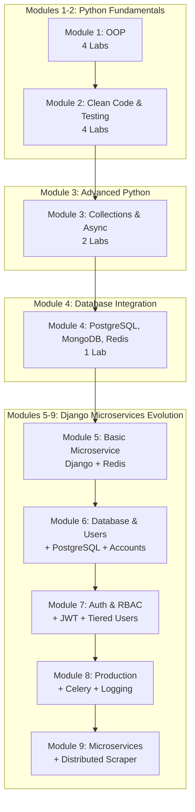
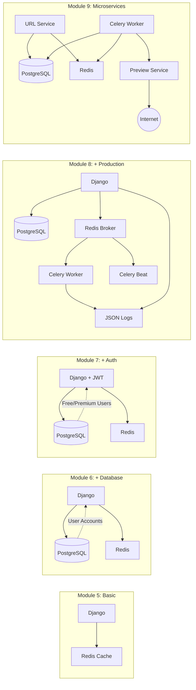
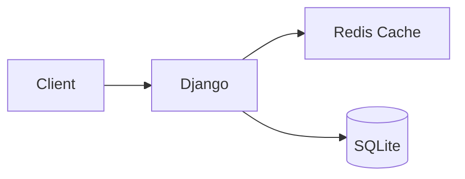
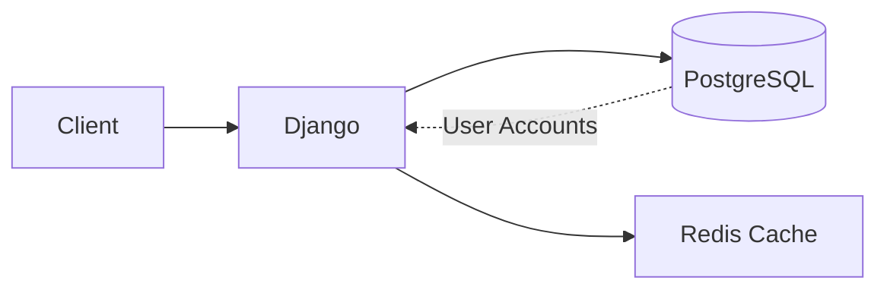
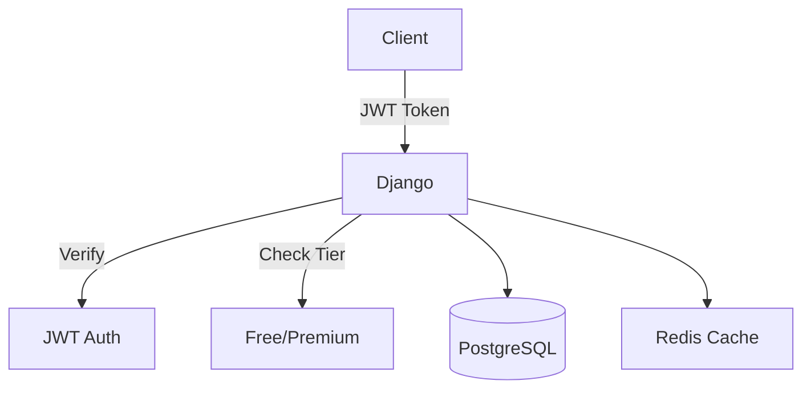
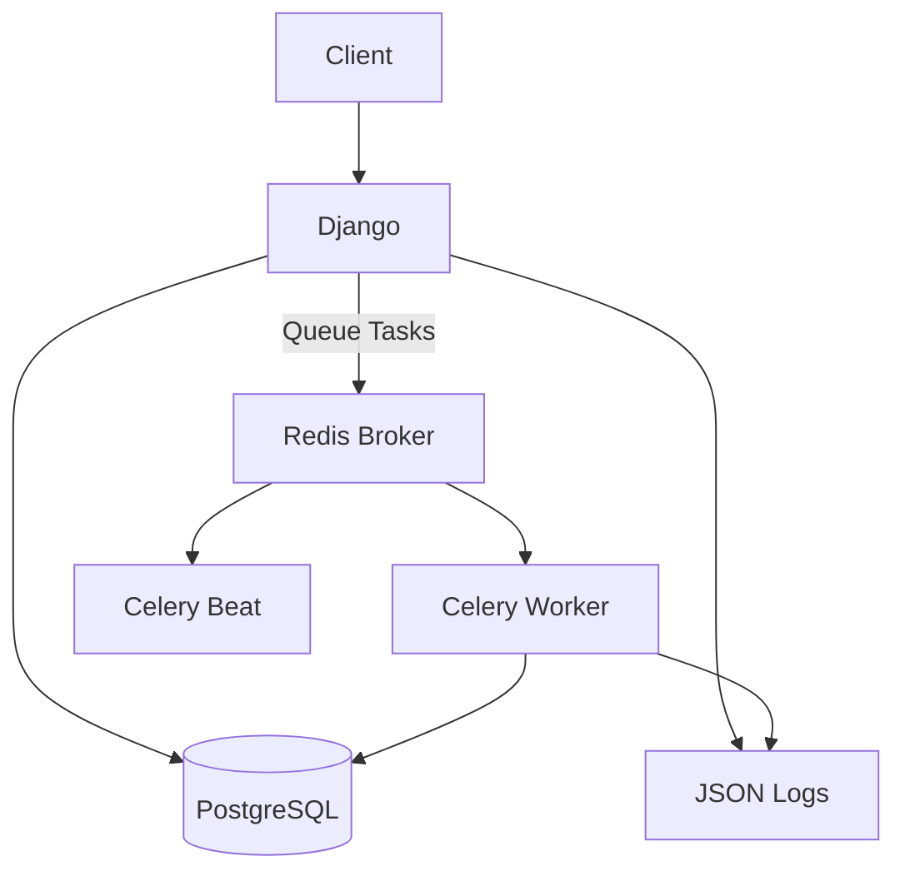

# Python Labs - Complete Monorepo

A comprehensive Python learning journey from **OOP fundamentals** to **production-ready Django microservices** with Celery, JWT authentication, and structured logging.

##  Repository Architecture



##  Modules Overview

| Module | Focus | Labs | Key Technologies |
|--------|-------|------|------------------|
| **[Module 1](./module1)** | OOP Fundamentals | 4 | Classes, Inheritance, Polymorphism |
| **[Module 2](./module2)** | Clean Code & Testing | 4 | TDD, pytest, bcrypt, PostgreSQL |
| **[Module 3](./module3)** | Advanced Python | 2 | asyncio, aiohttp, dataclasses |
| **[Module 4](./module4)** | Database Integration | 1 | PostgreSQL, MongoDB, Redis |
| **[Module 5](./module5)** | Django Microservices | 1 | Django REST, Redis, Docker |
| **[Module 6](./module6)** | PostgreSQL & Users | 1 | PostgreSQL, Custom User Model |
| **[Module 7](./module7)** | Auth & Authorization | 1 | JWT, RBAC, Rate Limiting |
| **[Module 8](./module8)** | Production Features | 1 | Celery, Celery Beat, JSON Logging |
| **[Module 9](./module9)** | Microservices | 1 | Microservices, Circuit Breaker, Retries |

##  Django Microservices Evolution (Modules 5-8)

### Architecture Progression



### Feature Comparison

| Feature | Module 5 | Module 6 | Module 7 | Module 8 |
|---------|----------|----------|----------|----------|
| **Database** | SQLite | PostgreSQL | PostgreSQL | PostgreSQL |
| **Caching** | Redis | Redis | Redis | Redis |
| **User Accounts** | ❌ | ✅ | ✅ | ✅ |
| **Authentication** | ❌ | Basic | JWT | JWT |
| **Authorization** | ❌ | ❌ | RBAC (Free/Premium) | RBAC |
| **Rate Limiting** | ❌ | ❌ | ✅ | ✅ |
| **Click Tracking** | ❌ | ❌ | ✅ | ✅ (Async) |
| **Async Tasks** | ❌ | ❌ | ❌ | Celery |
| **Scheduled Tasks** | ❌ | ❌ | ❌ | Celery Beat |
| **Logging** | Basic | Basic | Basic | JSON Structured | JSON Structured |
| **Docker Services** | 2 (web, redis) | 3 (web, db, redis) | 3 | 5 (web, db, redis, worker, beat) | 6 (web, db, redis, worker, beat, preview) |

##  Quick Start

### Prerequisites

- Python 3.11+
- Docker & Docker Compose (for Django modules)
- PostgreSQL (for local development)
- Git

### Running Any Module

```bash
# Navigate to module
cd module{X}

# For Django modules (5-8)
docker-compose up -d
docker exec -it url_shortener_web python manage.py migrate
docker exec -it url_shortener_web python manage.py createsuperuser

# For Python modules (1-4)
python -m venv venv
venv\Scripts\activate  # Windows
pip install -r requirements.txt
python main.py
```

##  Module Details

### Module 1: OOP Fundamentals

**Labs**: Employee Payroll, Library Management, Student Management, Vehicle Rental

**Key Concepts**:
- Classes and Objects
- Inheritance and Polymorphism
- Abstract Base Classes
- Encapsulation

[View Module 1 Details →](./module1)

---

### Module 2: Clean Code & Testing

**Labs**: Data Importer, Weather API Stub, Secure Service, Data Pipeline

**Key Concepts**:
- Test-Driven Development (TDD)
- Unit Testing with pytest
- Mocking and Dependency Injection
- bcrypt Password Hashing
- PostgreSQL Integration

[View Module 2 Details →](./module2)

---

### Module 3: Advanced Python

**Labs**: Grade Analytics Tool, Async Web Scraper

**Key Concepts**:
- Advanced Collections (Counter, defaultdict, deque)
- Type Hints and dataclasses
- Asynchronous Programming (asyncio, aiohttp)
- Performance Optimization
- Threading vs Async Comparison

[View Module 3 Details →](./module3)

---

### Module 4: Database Integration

**Lab**: E-Commerce Analytics Pipeline

**Key Concepts**:
- PostgreSQL (3NF, CTEs, Window Functions)
- MongoDB (Document Storage)
- Redis (Caching)
- Repository Pattern
- ACID Transactions

[View Module 4 Details →](./module4)

---

### Module 5: Django Microservices

**Lab**: URL Shortener Microservice

**Architecture**:


**Key Features**:
- Django REST Framework
- Redis Caching
- Swagger UI Documentation
- Docker Containerization

[View Module 5 Details →](./module5)

---

### Module 6: PostgreSQL & User Accounts

**Lab**: URL Shortener with PostgreSQL

**Architecture**:


**Key Features**:
- PostgreSQL Database
- Custom User Model
- URL Ownership
- Docker Compose (3 services)

[View Module 6 Details →](./module6)

---

### Module 7: Authentication & Authorization

**Lab**: URL Shortener with JWT & RBAC

**Architecture**:


**Key Features**:
- JWT Authentication (Access + Refresh Tokens)
- Role-Based Access Control (RBAC)
- Tiered Users (Free: 10 URLs, Premium: Unlimited)
- Rate Limiting (5 login attempts/min)
- Click Tracking with Analytics

[View Module 7 Details →](./module7)

---

### Module 8: Production Features

**Lab**: URL Shortener with Celery & Logging

**Architecture**:


**Key Features**:
- Celery Worker (Async Task Processing)
- Celery Beat (Scheduled Tasks)
- Structured JSON Logging
- Async Click Tracking
- Production-Ready Docker Setup (5 services)

[View Module 8 Details →](./module8)

---

## Technology Stack

### Core Python
- Python 3.11+
- dataclasses, typing, pathlib
- collections (Counter, defaultdict, deque)

### Testing & Quality
- pytest, black, mypy, ruff
- pre-commit hooks

### Databases
- PostgreSQL 15
- MongoDB Atlas
- Redis 7

### Django & APIs
- Django 5.0-6.0
- Django REST Framework
- djangorestframework-simplejwt
- drf-spectacular (Swagger)

### Async & Task Queue
- asyncio, aiohttp
- Celery 5.3
- Celery Beat

### Containerization
- Docker
- Docker Compose

##  Repository Structure

```
Labs/
├── module1/                    # OOP Fundamentals (4 labs)
├── module2/                    # Clean Code & Testing (4 labs)
├── module3/                    # Advanced Python (2 labs)
├── module4/                    # Database Integration (1 lab)
├── module5/                    # Django Microservices (1 lab)
│   └── url/                    # Basic URL Shortener
├── module6/                    # PostgreSQL & Users (1 lab)
│   └── url/                    # + PostgreSQL + Accounts
├── module7/                    # Auth & Authorization (1 lab)
│   └── url/                    # + JWT + RBAC
└── module8/                    # Production Features (1 lab)
    └── url/                    # + Celery + Logging
└── module9/                    # Microservices Essentials (1 lab)
    ├── url/                    # Main URL Service
    └── preview_service/        # Preview Microservice
```

##  Completion Status

- [x] **Module 1**: 4/4 Labs Complete
- [x] **Module 2**: 4/4 Labs Complete
- [x] **Module 3**: 2/2 Labs Complete
- [x] **Module 4**: 1/1 Lab Complete
- [x] **Module 5**: 1/1 Lab Complete
- [x] **Module 6**: 1/1 Lab Complete
- [x] **Module 7**: 1/1 Lab Complete
- [x] **Module 8**: 1/1 Lab Complete
- [x] **Module 9**: 1/1 Lab Complete

**Total**: 16 Labs Across 9 Modules 

##  Learning Path

### Beginner Track (Modules 1-2)
Start here if you're new to Python or OOP:
1. Module 1: Learn OOP fundamentals
2. Module 2: Master testing and clean code

### Intermediate Track (Modules 3-4)
Advanced Python concepts and databases:
3. Module 3: Async programming and advanced collections
4. Module 4: Multi-database integration

### Advanced Track (Modules 5-8)
Production-ready Django microservices:
5. Module 5: Basic Django REST API
6. Module 6: Add PostgreSQL and user accounts
7. Module 7: Implement JWT authentication and RBAC
8. Module 8: Add Celery for async tasks and structured logging
9. Module 9: Decouple into Microservices with a distributed scraper

##  Development Workflow

### For Python Labs (Modules 1-4)

```bash
cd module{X}/{lab-name}
python -m venv venv
venv\Scripts\activate
pip install -r requirements.txt
pytest -v  # Run tests
python main.py  # Run application
```

### For Django Labs (Modules 5-8)

```bash
cd module{X}/url
docker-compose up -d
docker exec -it url_shortener_web python manage.py migrate
docker exec -it url_shortener_web python manage.py createsuperuser

# Access Swagger UI
http://localhost:8000/api/schema/swagger-ui/
```

##   Key Metrics

- **Total Lines of Code**: ~15,000+
- **Test Coverage**: >80% (Modules 2-4)
- **Docker Services**: 5 (Module 8)
- **API Endpoints**: 20+ (Django modules)
- **Database Tables**: 15+ across all modules

##  Author

**Diane Ishimwe**
- Email: ishimwediane400@gmail.com
- GitHub: [@Ishimwediane](https://github.com/Ishimwediane)

##  License

Educational project for Python Backend and AI Application Track (2025-2026)

---

**🎉 Complete Python Learning Journey - From Fundamentals to Production!**
