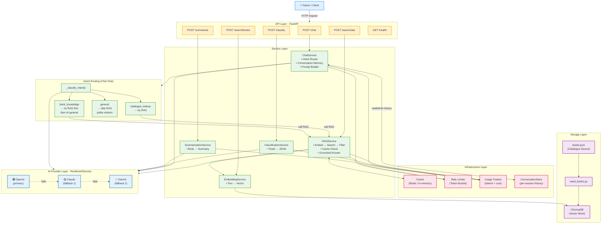

# LibraryMind — System Architecture

> Full system overview including all services, infrastructure, and the final intent-routing layer added to the chat service.

---

## High-Level Architecture



---

## Component Breakdown

### Configuration (`app/config.py`)
Loads and validates all settings from `.env` using Pydantic `BaseSettings`.
The app refuses to start if no AI provider key is present.

---

### API Layer (`app/api/routers/`)

| Router | Endpoint | Purpose |
|---|---|---|
| `chat.py` | `POST /chat` | Multi-turn AI librarian conversation |
| `search.py` | `POST /search/books` | Semantic vector search with pagination |
| `search.py` | `POST /search/ask` | RAG Q&A grounded in the catalogue |
| `classify.py` | `POST /classify` | Support ticket → structured JSON |
| `summarise.py` | `POST /summarise` | Book entry → AI summary |
| `health.py` | `GET /health` | Provider + service health check |

The API layer holds **no business logic** — it validates inputs via Pydantic and delegates to services.

---

### Service Layer (`app/services/`)

#### `ChatService`
Orchestrates multi-turn conversation:
1. Auto-generate or reuse `conversation_id`
2. Enforce session message cap (pre-AI check)
3. Load + truncate conversation history
4. **Classify intent** → route to RAG or skip
5. Build system + user prompt based on intent and catalogue results
6. Call `ResilientAIService.generate()`
7. Track usage, save turn to `ConversationStore`

#### Intent Routing (final design)

```
Message
  └─► _classify_intent()   [temp=0, max_tokens=10 — cheap & fast]
            │
    ┌───────┼────────────┐
    ▼       ▼            ▼
catalogue  book_      general
_lookup    knowledge  (off-topic)
    │       │            │
    ▼       ▼            └──► skip RAG
  RAG      RAG               polite redirect
    │       │
    └───────┤
      Catalogue has results?
            │
           YES ──► upgrade intent to catalogue_lookup
                   AI grounded in results
                   sources populated ✅
            │
           NO  ──► book_knowledge: AI uses general knowledge
                   general: warm redirect to books
```

#### `RAGService`
Full RAG pipeline for `POST /search/ask`:
1. Cache check (namespace `rag:v1`)
2. Rate limit acquire
3. Embed question → vector
4. ChromaDB similarity search (top-K)
5. Apply genre / year filters
6. Drop results below `RAG_RELEVANCE_THRESHOLD`
7. If no results → warm helpful message with search tips
8. Build grounded prompt → AI generate
9. Track usage, cache result

#### `EmbeddingService`
Converts raw text to dense vectors via the active AI provider.
Used by both the seed script (book ingestion) and runtime search.

#### `ClassificationService`
Classifies patron support tickets into:
- **Category**: account / borrowing / technical / complaint / suggestion / general
- **Priority**: low / medium / high / urgent
- **Sentiment**: positive / neutral / negative
- **Department**: Circulation / IT Support / Collections / Reference / Membership / Billing / Administration
- **Summary**: ≤12-word description

#### `SummarisationService`
Generates concise AI summaries of book catalogue entries.

---

### Infrastructure Layer (`app/infrastructure/`)

| Component | Purpose |
|---|---|
| `ConversationStore` | In-memory dict of `conversation_id → [messages]`. Redis in production. |
| `CacheService` | Deterministic key → cached response. Avoids repeated AI calls for identical queries. |
| `TokenBucketRateLimiter` | Prevents API abuse. Blocks when token bucket is empty. |
| `UsageTracker` | Counts prompt + completion tokens, estimates USD cost per provider and model. |
| `ChromaVectorStore` | Thin wrapper around ChromaDB for `search()` and `add()` operations. |

---

### AI Provider Layer (`app/providers/`)

```
ResilientAIService
  ├── 🟢 OpenAI    (primary — fastest, default)
  ├── 🟡 Claude    (fallback 1 — if OpenAI fails or quota exceeded)
  └── 🔵 Gemini   (fallback 2 — last resort)

All fail → RuntimeError → API returns 503 Service Unavailable
```

All providers implement the same `BaseAIProvider` interface so they are interchangeable.

---

### Storage Layer

| Component | Purpose |
|---|---|
| `data/books.json` | Source of truth for the library catalogue |
| `scripts/seed_books.py` | Embeds each book and upserts into ChromaDB |
| `chroma_db/` | Local persistent vector store (auto-created on first seed) |

---

## Data Flow Summary

### Chat (`POST /chat`)

```
Client → POST /chat
  └─► ChatService
        ├─ classify_intent()    [AI call — temp=0, ≤10 tokens]
        ├─ if catalogue/book: retrieve_context()
        │     └─ EmbeddingService → ChromaDB → filter → book list
        ├─ build_system_prompt(intent, has_context)
        ├─ build_user_prompt(history, context, message, intent)
        ├─ ResilientAIService.generate()
        ├─ usage_tracker.record_usage()
        └─ conversation_store.append_message()
  └─► { reply, sources, conversation_id }
```

### Search/Ask (`POST /search/ask`)

```
Client → POST /search/ask
  └─► RAGService
        ├─ cache_service.get(key)          → HIT: return cached
        ├─ rate_limiter.acquire()
        ├─ embedding_service.embed_text()
        ├─ vector_store.search(top_k)
        ├─ apply_filters(genre, year)
        ├─ filter_results(score >= threshold)
        ├─ if empty: return warm "no results" message with search tips
        ├─ build_system_prompt() + build_user_prompt(context)
        ├─ ResilientAIService.generate()
        ├─ usage_tracker.record_usage()
        └─ cache_service.set(key, result)
  └─► { answer, sources, cached }
```

---

*LibraryMind · Final Architecture Documentation*
