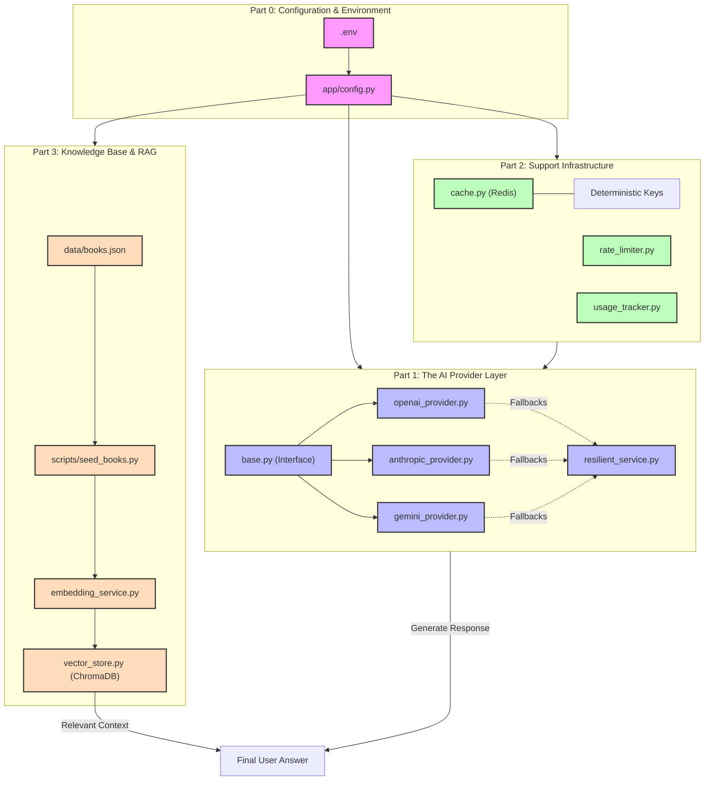

# LibraryMind Architecture

This document visualizes the internal architecture of the LibraryMind project, showcasing how the configuration, AI providers, and infrastructure components interact to provide a resilient semantic search experience.

## Component Breakdown

### Part 0: Configuration
Handles the loading and validation of environment variables using Pydantic. It ensures the app doesn't start unless the required API keys and settings are present.

### Part 1: AI Layer
A resilient multi-provider setup. It implements an abstract base class for AI providers, allowing the application to switch between OpenAI, Anthropic, and Gemini seamlessly if one fails or hits a quota limit.

### Part 2: Infrastructure
The "Utility" layer:
- **Cache**: Reduces API costs and latency by storing deterministic results in Redis.
- **Rate Limiter**: Implements a Token Bucket algorithm to prevent API abuse.
- **Usage Tracker**: Estimates USD costs and token usage in real-time.

### Part 3: Knowledge Base
The search engine:
- **ChromaDB**: A vector database for storing book embeddings.
- **Embedding Service**: Converts raw book descriptions into semantic vectors.
- **Seed Script**: Automates the ingestion of the `books.json` dataset.
