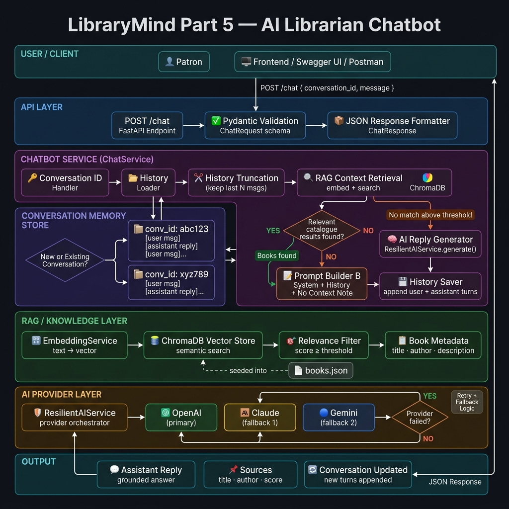
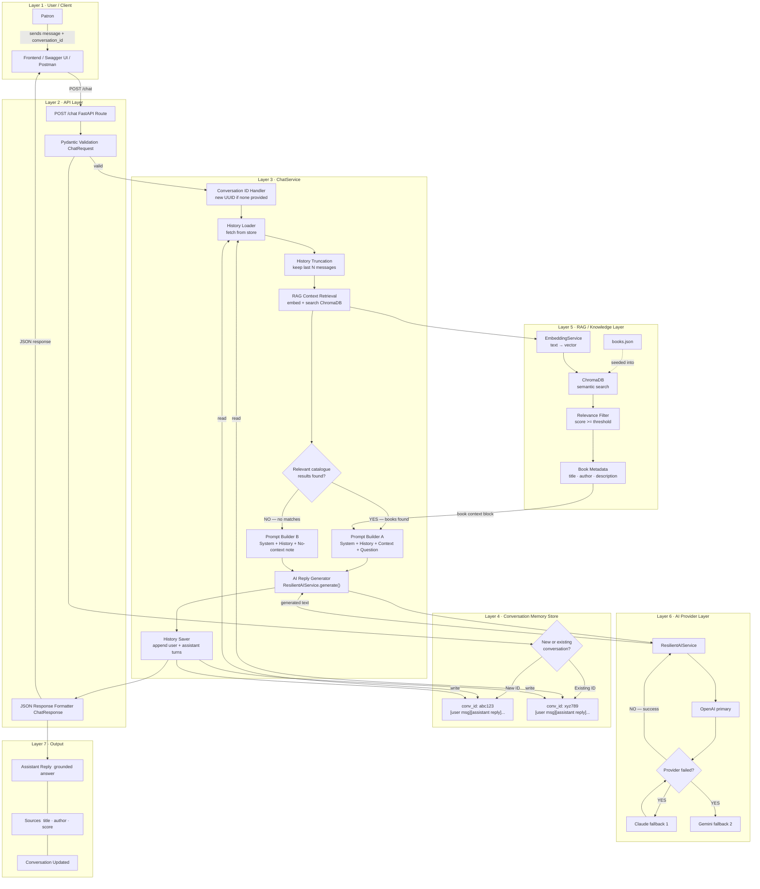

# LibraryMind — Part 5: AI Librarian Chatbot Architecture

> **Scope:** `/chat` endpoint — multi-turn, memory-aware, RAG-grounded conversation.

---

## System Architecture Diagram



---

## Architecture Overview

Part 5 builds the **AI Librarian Chatbot** on top of everything built in Parts 0–4.
The key upgrade over Part 4 (one-shot RAG) is **persistent conversation memory**: the
chatbot remembers previous turns within a session, so follow-up questions like
*"Tell me more about that one"* resolve correctly.

---

## Layer-by-Layer Breakdown

### Layer 1 — User / Client

The patron sends a `POST /chat` request containing:

```json
{
  "conversation_id": "a3f9c1-...",
  "message": "Is there a sequel to the one you mentioned?"
}
```

If `conversation_id` is omitted, the server creates a new UUID and starts a fresh session.

---

### Layer 2 — API Layer (`POST /chat`)

| Component | Role |
|---|---|
| FastAPI route | Receives the HTTP request |
| Pydantic `ChatRequest` | Validates input fields |
| Pydantic `ChatResponse` | Formats the final JSON reply |

The API layer holds **no business logic** — it delegates entirely to `ChatService`.

---

### Layer 3 — ChatService (Orchestration)

The core of Part 5. Full execution order:

1. **Conversation ID Handler** — reuse existing ID or generate new UUID
2. **History Loader** — fetch previous messages from `ConversationStore`
3. **History Truncation** — keep only the last N messages (e.g. 10) to stay within the LLM context window
4. **RAG Context Retrieval** — embed the current message → search ChromaDB → filter by relevance score

**Decision Branch:**

| Condition | Action |
|---|---|
| Relevant books found | **Prompt Builder A** — System + History + Book Context + Question |
| No relevant books | **Prompt Builder B** — System + History + "no results" note + Question |

5. **AI Reply Generator** — calls `ResilientAIService.generate()`
6. **History Saver** — appends both user message and assistant reply to the conversation store

---

### Layer 4 — Conversation Memory Store

```python
# Conceptual structure
{
  "conv_id: abc123": [
      {"role": "user",      "content": "..."},
      {"role": "assistant", "content": "..."},
  ],
  "conv_id: xyz789": [
      {"role": "user",      "content": "..."},
      {"role": "assistant", "content": "..."},
  ]
}
```

- **Isolation**: each `conversation_id` key is completely separate.
- **MVP**: plain Python `dict` (in-memory).
- **Production**: Redis for persistence across restarts.

**Truncation rule:** Before building the prompt, only `history[-N:]` is used.
Older messages are kept in the store for records but not sent to the LLM.

---

### Layer 5 — RAG / Knowledge Layer (reused from Part 4)

| Component | Role |
|---|---|
| `EmbeddingService` | Converts the current user message to a vector |
| `ChromaVectorStore` | Finds top-K most semantically similar books |
| Relevance Filter | Drops results below `RAG_RELEVANCE_THRESHOLD` |
| Book Metadata | Title, author, description passed into the prompt |
| `books.json` | Original data source, already seeded into ChromaDB |

> No changes to Part 4 files. ChatService calls the same retrieval logic.

---

### Layer 6 — AI Provider Layer (reused from Part 3)

```
ResilientAIService
    ├── 🟢 OpenAI    ← primary
    ├── 🟡 Claude    ← fallback 1 (if OpenAI fails)
    └── 🔵 Gemini   ← fallback 2 (if Claude also fails)
```

If all providers fail → `RuntimeError` → API returns `503 Service Unavailable`.

---

### Layer 7 — Output

```json
{
  "conversation_id": "a3f9c1-...",
  "reply": "Yes — Dune Messiah by Frank Herbert is the direct sequel...",
  "sources": [
    {"title": "Dune Messiah", "author": "Frank Herbert", "score": 0.88}
  ],
  "turn": 3
}
```

The client stores `conversation_id` and sends it with every subsequent message.

---

## Key Concepts at a Glance

| Concept | What it means |
|---|---|
| **Conversation ID** | A unique UUID that groups all messages in one chat session |
| **Message History** | A list of `{"role": "user/assistant", "content": "..."}` dicts per session |
| **Truncation** | Only the last N messages are sent to the LLM to control cost and context size |
| **RAG in Chat** | The current message is embedded and searched every turn to ground the reply in the catalogue |
| **Follow-up resolution** | The history block in the prompt lets the LLM understand references like "that one" |
| **Grounding** | The system prompt forbids the model from inventing books not in the retrieved context |

---

## New Files Added in Part 5

| File | Purpose |
|---|---|
| `app/api/chat.py` | FastAPI `/chat` route |
| `app/services/chat_service.py` | Multi-turn orchestration logic |
| `app/infrastructure/conversation_store.py` | Per-session message history storage |
| `docs/chatbot_architecture.md` | This document |
| `docs/part5_chatbot_architecture.png` | Architecture diagram |

---

## Mermaid Flowchart



---

*LibraryMind · Part 5 · AI Librarian Chatbot · Architecture Documentation*
