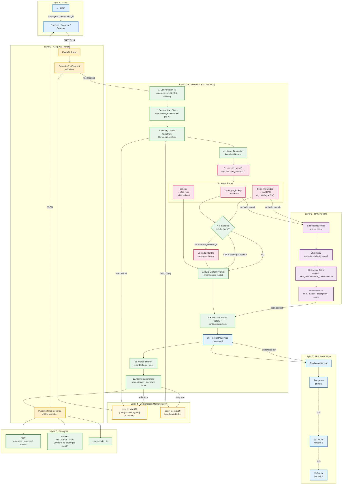

# LibraryMind — Chat Service Architecture

> **Scope:** `POST /chat` — multi-turn, memory-aware, intent-routed, RAG-grounded conversation.

---

## What Changed (Final Version)

The original chat service always called RAG for every message. The final version adds an **Intent Router** that classifies each message first, so the AI gives the right answer for every type of question — without wasting RAG calls or saying "I don't know."

| Old Behaviour | Final Behaviour |
|---|---|
| Always calls RAG | Classifies intent first, then routes |
| Returns "I don't know" for general questions | Answers general book questions from AI knowledge |
| `sources: []` for book knowledge questions | Tries catalogue first — sources populated when found |
| Off-topic questions answered freely | Off-topic questions get a polite redirect to books |
| One fixed system prompt | Three context-aware system prompt modes |

---

## Intent Classification

Before any RAG call, the service runs a lightweight classification:

```python
_classify_intent(message)
  → "catalogue_lookup"   # asks about books in THIS library
  → "book_knowledge"     # asks about books/authors in general
  → "general"            # unrelated to books entirely
```

**Cost:** `temperature=0`, `max_tokens=10` — the cheapest possible AI call.

### Routing Decision Table

| Intent | RAG called? | Catalogue found? | Final behaviour |
|---|---|---|---|
| `catalogue_lookup` | ✅ Yes | ✅ Yes | Grounded in catalogue + sources |
| `catalogue_lookup` | ✅ Yes | ❌ No | Warm "not in our collection" message |
| `book_knowledge` | ✅ Yes | ✅ Yes | Intent upgraded → grounded in catalogue + sources |
| `book_knowledge` | ✅ Yes | ❌ No | AI answers from general literary knowledge |
| `general` | ❌ No | — | Polite redirect back to books |

---

## Full Execution Flow



---

## System Prompt Modes

The system prompt changes based on intent and whether the catalogue returned results:

### Mode A — Catalogue results found (`catalogue_lookup` + results)
```
CATALOGUE SEARCH MODE — Books were found:
1. ONLY discuss books in the Library Catalogue Context
2. NEVER invent titles, authors, ISBNs, or plot details
3. Cite exact title and author from catalogue
4. Highlight relevance; compare multiple matches
```

### Mode B — Catalogue miss (`catalogue_lookup` + no results)
```
CATALOGUE SEARCH MODE — No matching books found:
1. Apologise warmly and honestly
2. Suggest different keywords or genres
3. MAY mention 1-2 well-known books from general knowledge
   (clearly NOT in this library)
4. Invite patron to ask about something else
```

### Mode C — General book knowledge (`book_knowledge` + no catalogue match)
```
BOOK KNOWLEDGE MODE:
1. Answer from general literary knowledge
2. Be accurate — no invented facts
3. Invite patron to search the LibraryMind catalogue
4. Keep focused on books and reading
```

### Mode D — Off-topic (`general`)
```
OUT-OF-SCOPE MESSAGE:
1. Politely acknowledge the question
2. Explain you specialise in books and reading
3. Redirect with a warm invitation to search
4. Brief, friendly, never dismissive
Example: "That's a bit outside my bookshelf! Is there a book I can find for you?"
```

---

## User Prompt Structure

```
=== Conversation History ===          (if any)
Patron: ...
Librarian: ...

=== Library Catalogue Results ===     (if catalogue_lookup + results)
BOOK 1:
  Title:  The Name of the Rose
  Author: Umberto Eco
  Relevance score: 0.87

LIMITATION: You may only refer to books listed above.

            OR

=== Library Catalogue Results ===     (if catalogue_lookup + no results)
No books matched this search.
Apologise warmly, suggest alternatives...

            OR

=== Instruction ===                   (if book_knowledge or general)
[context-appropriate instruction]

=== Patron's Message ===
<message>

Librarian (Mira) Response:
```

---

## Conversation Memory

```python
# ConversationStore internal structure
{
  "conv-id-abc": [
    {"role": "user",      "content": "Do you have sci-fi books?"},
    {"role": "assistant", "content": "Yes! We have Dune by Frank Herbert..."},
    {"role": "user",      "content": "Tell me more about that one"},
    {"role": "assistant", "content": "Dune is set on the desert planet Arrakis..."},
  ]
}
```

- **Isolation:** each `conversation_id` is completely independent
- **Truncation:** only `history[-N:]` is sent to the LLM (controlled by `CHAT_HISTORY_LIMIT`)
- **Cap:** sessions are hard-capped at `MAX_MESSAGES_PER_SESSION` turns

---

## Key Files

| File | Role |
|---|---|
| [`app/api/routers/chat.py`](../app/api/routers/chat.py) | FastAPI `/chat` route + error handling |
| [`app/services/chat_service.py`](../app/services/chat_service.py) | All orchestration, intent routing, prompt building |
| [`app/services/rag_service.py`](../app/services/rag_service.py) | RAG pipeline called by the chat service |
| [`app/infrastructure/conversation_store.py`](../app/infrastructure/conversation_store.py) | Per-session message history |

---

## Example Conversations

### Book in catalogue
```
Patron:    "Do you have mystery books set in Paris?"
Intent:    catalogue_lookup
RAG:       ✅ called → 2 books found
Sources:   [{ title, author, score }]
Reply:     "Great news! We have 'The Murders of Rue Morgue'..."
```

### Book knowledge (catalogue miss)
```
Patron:    "Who wrote Harry Potter?"
Intent:    book_knowledge
RAG:       ✅ called → no match
Sources:   []
Reply:     "Harry Potter was written by J.K. Rowling..."
           "Would you like me to search our catalogue for fantasy fiction?"
```

### Off-topic
```
Patron:    "What's the capital of France?"
Intent:    general
RAG:       ❌ skipped
Sources:   []
Reply:     "That's a bit outside my bookshelf! I'm your LibraryMind
            assistant — best at helping you discover great reads.
            Is there a book or topic I can search for you today?"
```

---

*LibraryMind · Chat Service · Final Architecture Documentation*
