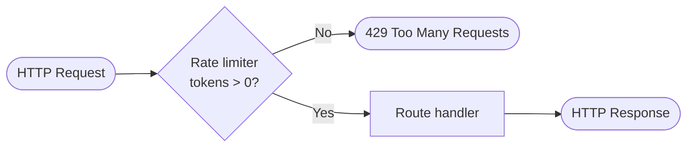
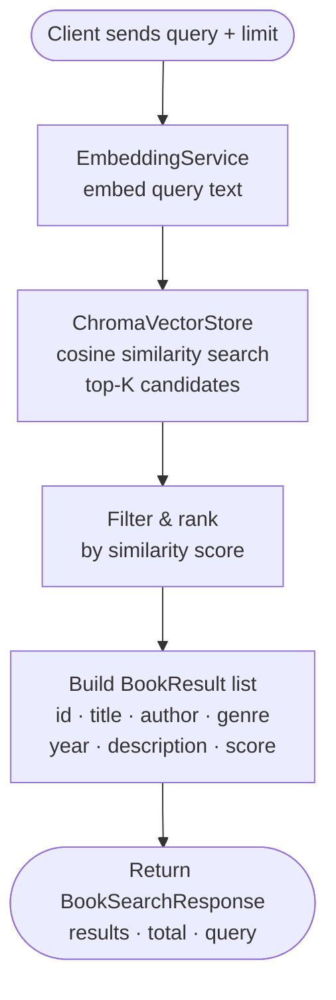
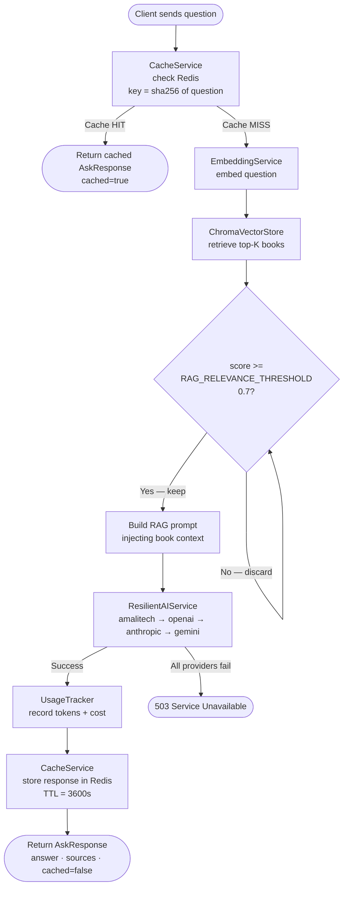
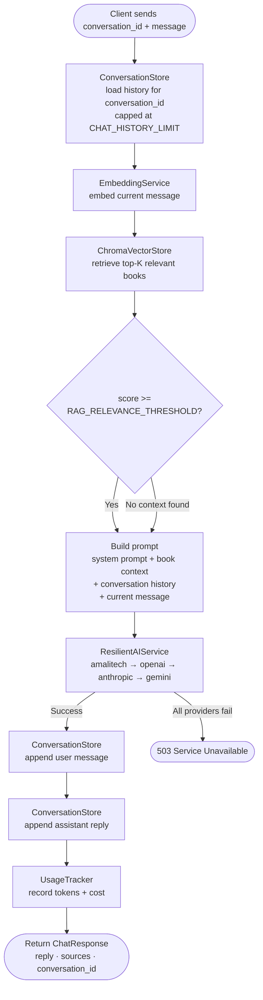
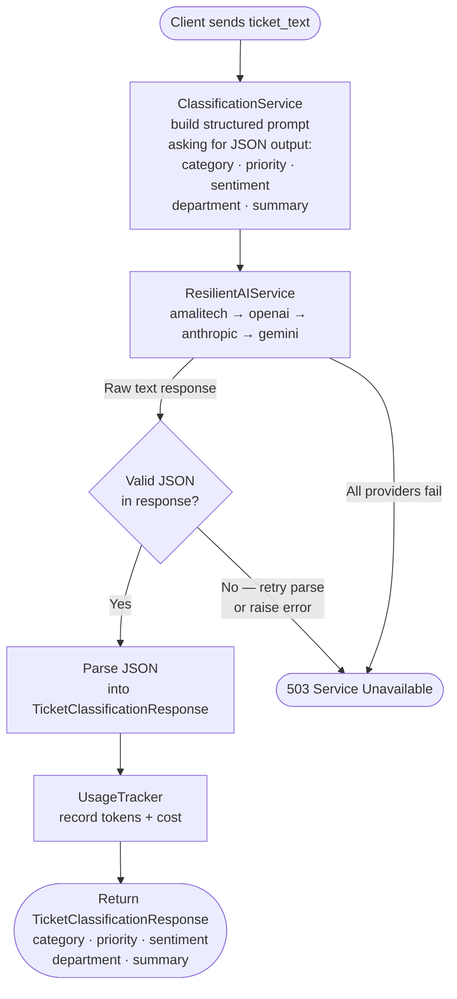
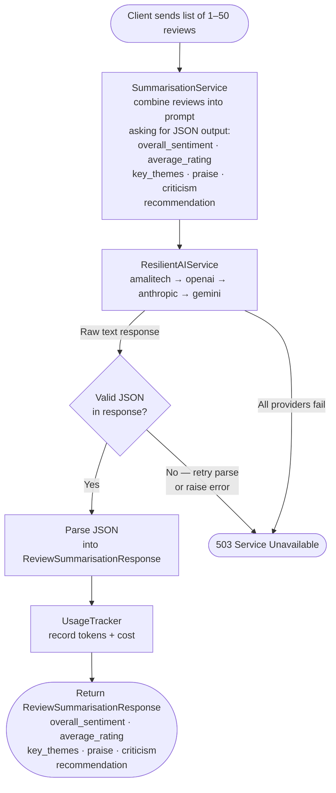
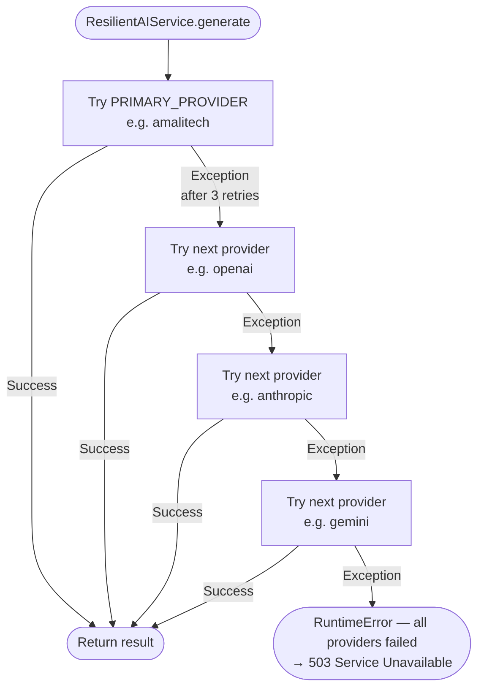

# LibraryMind — Data Flow Diagrams

Each diagram shows the full request lifecycle for one endpoint, from HTTP in to HTTP out.

---

## Shared infrastructure on every request

Before any endpoint logic runs, two cross-cutting checks fire:

---

## 1. `POST /search/books` — Semantic book search

**Key components:** `EmbeddingService` → `ChromaVectorStore`  
**No AI call, no cache** — pure vector search.

---

## 2. `POST /search/ask` — RAG question answering

**Key components:** `CacheService` → `EmbeddingService` → `ChromaVectorStore` → `RAGService` → `ResilientAIService` → `UsageTracker` → `CacheService`

---

## 3. `POST /chat` — Multi-turn librarian chat

**Key components:** `ConversationStore` → `EmbeddingService` → `ChromaVectorStore` → `ChatService` → `ResilientAIService` → `ConversationStore` → `UsageTracker`

**Memory management:** History is truncated to the most recent `CHAT_HISTORY_LIMIT` (default 10) messages before being injected into the prompt, keeping token usage bounded.

---

## 4. `POST /classify/ticket` — Support ticket classification

**Key components:** `ClassificationService` → `ResilientAIService` → `UsageTracker`  
**No vector search, no cache** — pure LLM classification with JSON output parsing.

---

## 5. `POST /summarise/reviews` — Review summarisation

**Key components:** `SummarisationService` → `ResilientAIService` → `UsageTracker`  
**No vector search, no cache** — pure LLM analysis with JSON output parsing.

---

## 6. `GET /health`

---

## Provider fallback flow (shared by all AI calls)

Provider order is: `PRIMARY_PROVIDER` first, then the remaining initialised providers in the order they appear in `_initialize_providers` (openai → anthropic → gemini → amalitech).
