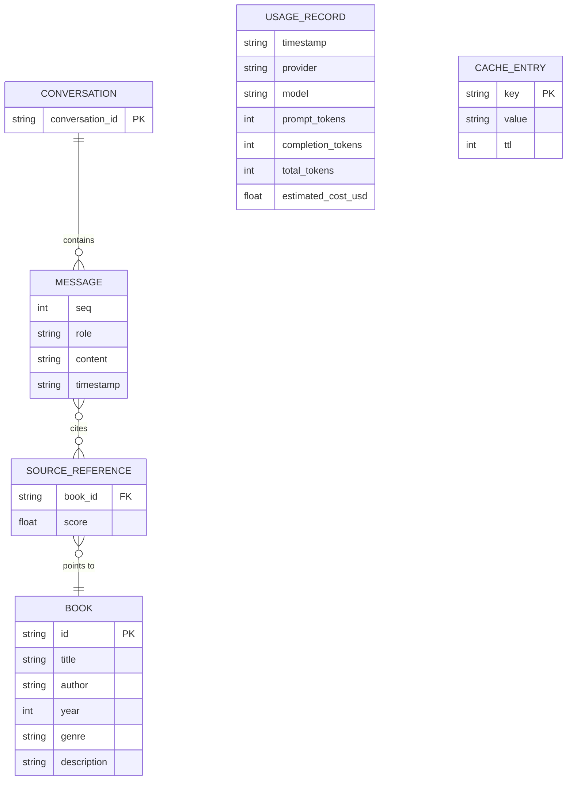

# LibraryMind — Entity Relationship Diagram

```mermaid
erDiagram

    BOOK {
        string id PK
        string title
        string author
        int    year
        string genre
        string description
    }

    CONVERSATION {
        string conversation_id PK
    }

    MESSAGE {
        int    seq
        string role
        string content
        string timestamp
    }

    SOURCE_REFERENCE {
        string book_id FK
        float  score
    }

    USAGE_RECORD {
        string timestamp
        string provider
        string model
        int    prompt_tokens
        int    completion_tokens
        int    total_tokens
        float  estimated_cost_usd
    }

    CACHE_ENTRY {
        string key PK
        string value
        int    ttl
    }

    CONVERSATION ||--o{ MESSAGE          : "contains"
    MESSAGE      }o--o{ SOURCE_REFERENCE : "cites"
    SOURCE_REFERENCE }o--|| BOOK         : "points to"
```
