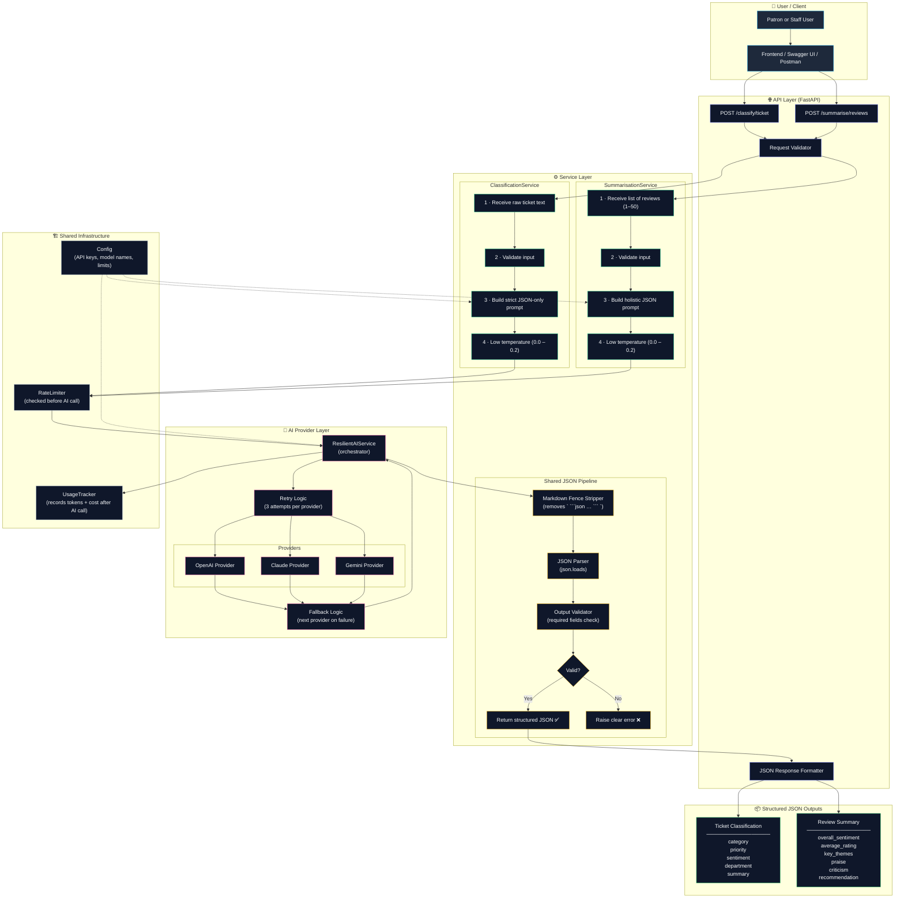

# LibraryMind — Part 6: Classification & Summarisation Architecture

> **Scope:** `/classify/ticket` and `/summarise/reviews` endpoints — structured JSON output from AI providers.

---

## 1. What Part 6 Does

Part 6 adds two new AI-powered services to LibraryMind:

| Service | Input | Output |
|---|---|---|
| **Ticket Classifier** | A raw support ticket (plain text) | Structured JSON: category, priority, sentiment, department, summary |
| **Review Summariser** | A list of 1–50 book reviews | Structured JSON: overall_sentiment, average_rating, key_themes, praise, criticism, recommendation |

Both services share the same underlying pattern:
1. Build a strict prompt that demands **JSON only** from the model.
2. Pass it through the existing **ResilientAIService** (OpenAI → Claude → Gemini with retry/fallback).
3. Strip any markdown code fences the model wraps around the JSON.
4. Parse and validate the JSON before returning it to the caller.

They reuse the same shared infrastructure (RateLimiter, UsageTracker, Config) that was built in earlier parts.

---

## 2. System Architecture Diagram



---

## 3. Step-by-Step Flow

### 3a. Ticket Classifier (`POST /classify/ticket`)

```
Step 1  →  Client sends raw ticket text  (e.g. "My library card is locked")
Step 2  →  API Layer validates the request (non-empty text, length limits)
Step 3  →  ClassificationService builds a strict prompt:
              "Return ONLY valid JSON. No markdown. No explanation.
               Classify this ticket: { category, priority, sentiment,
               department, summary }"
Step 4  →  Low temperature is set (0.0–0.2) to force deterministic output
Step 5  →  RateLimiter checks capacity — raises HTTP 429 if bucket is empty
Step 6  →  Prompt sent to ResilientAIService
Step 7  →  ResilientAIService tries OpenAI first, retries on failure,
               falls back to Claude then Gemini if needed
Step 8  →  Raw model response received  (may contain ```json … ``` fences)
Step 9  →  Markdown Fence Stripper removes any ``` wrappers
Step 10 →  json.loads() parses the cleaned string
Step 11 →  Output Validator checks all required fields are present
Step 12 →  UsageTracker records token count and estimated cost
Step 13 →  Structured classification JSON returned to client ✅
           OR clear error raised if JSON was invalid ❌
```

**Output shape:**
```json
{
  "category":   "account",
  "priority":   "high",
  "sentiment":  "frustrated",
  "department": "membership",
  "summary":    "Patron cannot access their account due to a locked card."
}
```

---

### 3b. Review Summariser (`POST /summarise/reviews`)

```
Step 1  →  Client sends a list of 1–50 review strings
Step 2  →  API Layer validates: list is not empty, max 50 items
Step 3  →  SummarisationService builds a holistic prompt:
              "Read all reviews. Return ONLY valid JSON with:
               overall_sentiment, average_rating, key_themes,
               praise, criticism, recommendation"
Step 4  →  Low temperature is set (0.0–0.2) for consistent output
Step 5  →  RateLimiter checked — raises HTTP 429 if needed
Step 6  →  Prompt sent to ResilientAIService
Step 7  →  Provider selected and response generated (with retry/fallback)
Step 8  →  Raw model response received
Step 9  →  Markdown Fence Stripper removes any ``` wrappers
Step 10 →  json.loads() parses the cleaned string
Step 11 →  Output Validator checks all required fields are present
Step 12 →  UsageTracker records token count and estimated cost
Step 13 →  Structured summary JSON returned to client ✅
           OR clear error raised if JSON was invalid ❌
```

**Output shape:**
```json
{
  "overall_sentiment": "positive",
  "average_rating":    4.2,
  "key_themes":        ["engaging plot", "clear writing", "slow start"],
  "praise":            "Readers loved the character development.",
  "criticism":         "Several found the first chapter slow.",
  "recommendation":    "Recommended for fans of historical fiction."
}
```

---

## 4. The Shared JSON Pipeline — How It Works

Both services feed their model output through the **same three-step pipeline**:

```
Raw model output
      │
      ▼
┌─────────────────────────────────────────┐
│  Step 1 — Markdown Fence Stripper       │
│  Removes:  ```json … ```  or  ``` … ``` │
│  Reason:   Models sometimes wrap JSON   │
│            in code fences even when     │
│            explicitly told not to.      │
└─────────────────────────────────────────┘
      │
      ▼
┌─────────────────────────────────────────┐
│  Step 2 — JSON Parser  (json.loads)     │
│  Converts the cleaned string into a     │
│  Python dict.                           │
│  Raises JSONDecodeError on failure.     │
└─────────────────────────────────────────┘
      │
      ▼
┌─────────────────────────────────────────┐
│  Step 3 — Output Validator              │
│  Checks that all required fields exist  │
│  in the parsed dict.                    │
│  Raises a clear ValueError on failure.  │
└─────────────────────────────────────────┘
      │
      ▼
  Structured JSON ✅  OR  Raised error ❌
```

---

## 5. Why Valid JSON Parsing Is Critical in Part 6

In Parts 1–5, LibraryMind's AI calls returned **free-form text** — the librarian's reply, a book recommendation, a summary paragraph. Small formatting quirks did not break anything.

Part 6 is different. The output must be **machine-readable JSON** because:

1. **Downstream code depends on it.** Other services, the frontend, or analytics pipelines will read fields like `priority` or `average_rating` programmatically. A stray sentence or missing field breaks them.

2. **Models are not perfectly obedient.** Even with a clear "return JSON only" instruction, a model may add an explanation sentence, wrap the response in code fences, or omit a field. The pipeline catches these cases instead of passing broken data upstream.

3. **Failures must be explicit.** If the JSON is invalid, it is better to raise a clear, descriptive error immediately than to silently return incomplete data. Silent failures are much harder to debug.

4. **Low temperature reduces (but does not eliminate) variance.** Setting temperature to 0.0–0.2 makes the model more deterministic. It does not guarantee perfect JSON every time — hence the dedicated parsing and validation steps.

> **Rule of thumb:** any Part 6 service that reads a specific field from a model response must validate that field exists and has the right type before returning it.

---

## 6. Component Responsibilities at a Glance

| Component | Responsibility |
|---|---|
| `ClassificationService` | Builds ticket prompt, calls shared pipeline, returns classification dict |
| `SummarisationService` | Builds review prompt, calls shared pipeline, returns summary dict |
| Markdown Fence Stripper | Removes ` ```json ` / ` ``` ` wrappers from raw model output |
| JSON Parser | Converts cleaned string → Python dict via `json.loads` |
| Output Validator | Checks all required fields are present in parsed dict |
| `ResilientAIService` | Tries providers in order, retries, falls back automatically |
| `RateLimiter` | Blocks the call if too many requests have been made recently |
| `UsageTracker` | Logs token count and estimated USD cost after each successful call |
| `Config` | Supplies API keys, model names, temperature defaults, and limits |

---

## 7. How Part 6 Relates to Earlier Parts

```
Part 1–2  →  Config, environment setup, FastAPI skeleton
Part 3    →  Embedding service, ChromaDB vector store
Part 4    →  RAG service (retrieval-augmented generation)
Part 5    →  Chatbot (multi-turn, memory, RAG-grounded)
Part 6    →  Classification + Summarisation  ← YOU ARE HERE
               (structured JSON output, shared parsing pipeline)
```

Part 6 does **not** use RAG or the conversation store. It calls the AI provider directly with a purpose-built prompt and enforces strict JSON output. The shared infrastructure (ResilientAIService, RateLimiter, UsageTracker) is unchanged.
