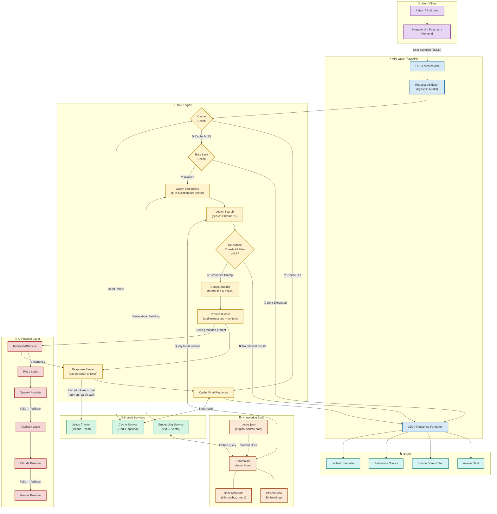

# LibraryMind — Part 4: RAG Engine Architecture

---

## What is RAG?

A regular AI model like ChatGPT only knows what it learned during training. If you ask it *"What books about robots do we have in our library?"*, it will either make something up (called **hallucination**) or say it doesn't know.

**RAG (Retrieval-Augmented Generation)** solves this by splitting the job into two steps:

1. **Retrieve** — First, search your own database for real, relevant information.
2. **Generate** — Then, hand that real information to the AI and say *"Only answer based on THIS. Cite your sources."*

The result is an AI that answers questions about **your specific data** accurately and honestly, without inventing facts.

---

## The Mermaid Architecture Diagram



---

## Request Flow: Step by Step

This is the exact journey a single question takes through the system.

| Step | What Happens | Component |
|------|-------------|-----------|
| 1 | User sends: `POST /search/ask` with `{ "question": "I want a sci-fi book about space survival" }` | Client |
| 2 | FastAPI validates the JSON shape (correct fields, types, limits) | Request Validation |
| 3 | Cache is checked: Has this exact question been asked before? | Cache Service (Redis) |
| 4 | **If Cache HIT** → return the saved answer immediately. No AI call needed. | Cache Service |
| 5 | **If Cache MISS** → check if the user is within their rate limit | Rate Limiter |
| 6 | The user's question is converted into a vector (list of numbers) | Embedding Service |
| 7 | That vector is compared against all 20 book vectors in ChromaDB | Vector Store |
| 8 | Top-K results are returned with similarity scores (e.g., 0.87, 0.74, 0.61) | Vector Store |
| 9 | **If all scores < 0.7** → return `"I couldn't find a relevant book."` No hallucination. | Threshold Filter |
| 10 | **If scores ≥ 0.7** → format those books into a readable "context block" | Context Builder |
| 11 | A prompt is built: `"You are a librarian. Answer ONLY from these books: [context]. Cite the title."` | Prompt Builder |
| 12 | The prompt is sent to `ResilientAIService`. It tries OpenAI first, then Claude, then Gemini | AI Provider Layer |
| 13 | The AI writes an answer. Tokens used and cost are recorded | Usage Tracker |
| 14 | The raw AI text is parsed into a clean structured object | Response Parser |
| 15 | The final response is saved in Redis for future identical questions | Cache Service |
| 16 | The user receives a JSON response with `answer`, `sources`, `scores`, `cached: false` | Output |

---

## Key Branches Explained

### ✅ Cache HIT
> The exact same question was asked before. Redis returns the stored answer in milliseconds. The AI is never called. No cost, no latency.

### ❌ Cache MISS
> The question is new. The full RAG pipeline runs. At the end, the answer is saved so the next identical question gets a Cache HIT.

### 🚫 Rate Limit Exceeded
> The user has made too many requests in the last minute. The Token Bucket is empty. The request is rejected with a `429 Too Many Requests` error before any expensive computation begins.

### ❌ No Relevant Results (Below Threshold)
> The best matching book scored below `0.7` (configured in `.env` as `RAG_RELEVANCE_THRESHOLD`). Instead of making up an answer, the system honestly responds: *"I couldn't find a book relevant to your question."* This prevents hallucination.

### ✅ Grounded Prompt
> At least one book cleared the relevance threshold. The AI is instructed to answer **only** from that context. It cannot invent facts. It must cite the book it used.

### 🔁 Provider Fallback
> If OpenAI is down or over quota (like we saw during testing), `ResilientAIService` catches the error and automatically retries with Claude, then Gemini. The user never sees the failure.

---

## What the Final Answer Looks Like

```json
{
  "answer": "Based on your interest in space survival, I recommend 'The Martian' by Andy Weir. It follows an astronaut stranded on Mars who must use science and ingenuity to survive...",
  "sources": [
    {
      "title": "The Martian",
      "author": "Andy Weir",
      "genre": "Science Fiction",
      "score": 0.91
    }
  ],
  "relevance_scores": [0.91, 0.78],
  "cached": false
}
```

> **`cached: false`** means this was a real AI call. If you ask the same question again, `cached: true` will appear and the response will be instant.
