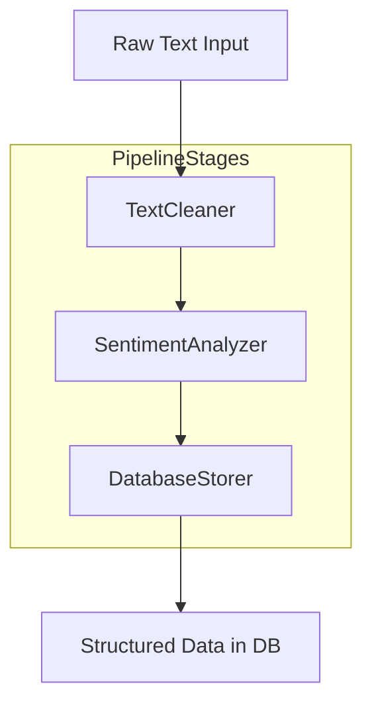

# Data Processing Pipeline (Lab 4)

## Overview
This project implements a **multi-stage data processing pipeline** that takes raw text, cleans it, analyzes its sentiment (simulated), and stores the structured result in a PostgreSQL database.

The pipeline is designed following **SOLID principles**, with each stage as a modular, independently testable component. This ensures clean architecture, maintainability, and robust error handling.

---

## Table of Contents
- [Objectives](#objectives)
- [Features](#features)
- [Architecture](#architecture)
- [Installation](#installation)
- [Usage](#usage)
- [Testing](#testing)
- [Error Handling](#error-handling)
- [Project Structure](#project-structure)
- [Contributing](#contributing)
- [Debugging](#debugging)
- [License](#license)

---

## Objectives
- Implement a modular, multi-stage data processing pipeline
- Apply **SOLID principles**, particularly the Single Responsibility Principle
- Write **unit and integration tests** using `pytest` and `testcontainers-python`
- Implement structured logging and custom exceptions for observability
- Use **Git workflow** with pre-commit hooks, clean commit history, and Pull Requests

---

## Features
- **TextCleaner** – Cleans raw text (removes punctuation, normalizes whitespace, lowercase)
- **SentimentAnalyzer** – Simulates sentiment analysis on cleaned text
- **DatabaseStorer** – Stores processed data into a PostgreSQL database
- Structured logging for debugging and tracing data flow
- Custom exceptions (`CleaningError`, `AnalysisError`, `StorageError`) for robust error handling
- Easy to extend: add or swap pipeline stages with minimal changes
- Comprehensive test coverage for both **unit and integration tests**
- Pre-commit hooks for code quality enforcement

---

## Architecture

### Pipeline Stages
The pipeline consists of three main stages that process data sequentially:

1. **TextCleaner** – Normalizes and cleans raw text input
2. **SentimentAnalyzer** – Performs sentiment analysis on cleaned text
3. **DatabaseStorer** – Persists structured data to PostgreSQL

### Data Flow Diagram


The diagram illustrates how data flows from raw input through all pipeline stages to final storage in the database.

### SOLID Principles Applied
- **Single Responsibility Principle**: Each stage handles one specific task
- **Open/Closed Principle**: Pipeline is open for extension (new stages) but closed for modification
- **Dependency Inversion**: Stages depend on abstractions, not concrete implementations

---

## Installation

### Prerequisites
- Python 3.11 or higher
- PostgreSQL (for integration testing via `testcontainers-python`)
- Docker (required for testcontainers)
- Git

### Clone Repository
```bash
git clone https://github.com/yourusername/data_processing_pipeline.git
cd data_processing_pipeline
```

### Create Virtual Environment
```bash
python -m venv venv
source venv/bin/activate  # On Windows: venv\Scripts\activate
```

### Install Dependencies
```bash
pip install -r requirements.txt
```

### Set Up Pre-commit Hooks
```bash
pre-commit install
```

This ensures code quality checks run automatically before each commit.

---

## Usage

### Running the Pipeline
Execute the full pipeline with example data:

```bash
python src/main.py
```

### Custom Configuration
You can modify pipeline behavior by editing configuration files:

#### Database Configuration
Update database connection settings in your environment or configuration file:

```python
DB_CONFIG = {
    "host": "localhost",
    "port": 5432,
    "database": "pipeline_db",
    "user": "your_user",
    "password": "your_password"
}
```

#### Logging Configuration
Logging is centralized in `src/config/logging_config.py`. You can adjust:
- Log level (DEBUG, INFO, WARNING, ERROR)
- Output format
- Log file location
- Console output settings

Example logging configuration:
```python
import logging

logging.basicConfig(
    level=logging.INFO,
    format='%(asctime)s - %(name)s - %(levelname)s - %(message)s',
    handlers=[
        logging.FileHandler('pipeline.log'),
        logging.StreamHandler()
    ]
)
```

### Processing Custom Data
```python
from src.pipeline.pipeline import DataPipeline
from src.pipeline.stages import TextCleaner, SentimentAnalyzer, DatabaseStorer

# Initialize pipeline
pipeline = DataPipeline([
    TextCleaner(),
    SentimentAnalyzer(),
    DatabaseStorer(db_config)
])

# Process your data
raw_text = "Your custom text here!"
result = pipeline.process(raw_text)
```

---

## Testing

### Run All Tests
```bash
pytest
```

### Unit Tests
Run isolated tests for individual pipeline stages:

```bash
pytest tests/unit
```

Unit tests cover:
- TextCleaner functionality
- SentimentAnalyzer logic
- DatabaseStorer operations (mocked)
- Exception handling
- Edge cases and boundary conditions

### Integration Tests
Run full pipeline integration tests with real PostgreSQL instances:

```bash
pytest tests/integration
```

Integration tests use `testcontainers-python` to spin up temporary PostgreSQL containers, ensuring tests run in isolated environments without affecting your local database.

### Test Coverage
Generate a coverage report:

```bash
pytest --cov=src --cov-report=html
```

View the HTML report at `htmlcov/index.html`

### Code Quality Checks

#### Format Code
```bash
black src/ tests/
```

#### Lint Code
```bash
ruff src/ tests/
```

#### Type Checking
```bash
mypy src/
```

#### Run All Quality Checks
```bash
pre-commit run --all-files
```

---

## Error Handling

The pipeline implements custom exceptions for clear error reporting and debugging:

### Custom Exceptions

- **`CleaningError`** – Raised by TextCleaner when text cleaning fails
- **`AnalysisError`** – Raised by SentimentAnalyzer when analysis fails
- **`StorageError`** – Raised by DatabaseStorer when database operations fail

### Exception Hierarchy
```python
PipelineError (Base Exception)
├── CleaningError
├── AnalysisError
└── StorageError
```

### Error Logging
Structured logging captures the state of data at each stage for easy debugging:

```python
logger.info("Starting text cleaning", extra={"raw_text_length": len(raw_text)})
try:
    cleaned_text = cleaner.clean(raw_text)
    logger.info("Text cleaned successfully", extra={"cleaned_length": len(cleaned_text)})
except CleaningError as e:
    logger.error("Cleaning failed", extra={"error": str(e)}, exc_info=True)
    raise
```

### Graceful Failure Handling
The pipeline is designed to fail fast with informative error messages, making it easy to identify and fix issues.

---

## Project Structure

```
data_processing_pipeline/
├── src/
│   ├── main.py                      # Entry point for pipeline execution
│   ├── pipeline/
│   │   ├── __init__.py
│   │   ├── stages.py                # TextCleaner, SentimentAnalyzer, DatabaseStorer
│   │   ├── pipeline.py              # DataPipeline orchestrator class
│   │   └── exceptions.py            # Custom exception definitions
│   └── config/
│       ├── __init__.py
│       └── logging_config.py        # Centralized logging configuration
├── tests/
│   ├── __init__.py
│   ├── unit/                        # Unit tests for individual stages
│   │   ├── test_text_cleaner.py
│   │   ├── test_sentiment_analyzer.py
│   │   └── test_database_storer.py
│   └── integration/                 # End-to-end pipeline tests
│       └── test_pipeline_integration.py
├── docs/
│   ├── architecture_diagram.png     # Visual representation of architecture
│   └── debugging_screenshots/       # Debug session documentation
├── .gitignore                       # Git ignore patterns
├── .pre-commit-config.yaml          # Pre-commit hook configuration
├── requirements.txt                 # Python dependencies
├── requirements-dev.txt             # Development dependencies
├── pytest.ini                       # Pytest configuration
├── pyproject.toml                   # Project metadata and tool configs
└── README.md                        # This file
```

---

## Contributing

We welcome contributions to improve this project! Whether it's bug fixes, new features, or documentation improvements, your help is appreciated.

### Getting Started

1. **Fork the Repository**
   ```bash
   git clone https://github.com/yourusername/data_processing_pipeline.git
   cd data_processing_pipeline
   ```

2. **Create a Feature Branch**
   ```bash
   git checkout -b feature/your-feature-name
   ```

3. **Make Your Changes**
   - Write clean, well-documented code
   - Follow existing code style and conventions
   - Add tests for new functionality

4. **Run Tests and Quality Checks**
   ```bash
   pytest
   pre-commit run --all-files
   ```

5. **Commit Your Changes**
   ```bash
   git add .
   git commit -m "feat: add your feature description"
   ```

6. **Push and Create Pull Request**
   ```bash
   git push origin feature/your-feature-name
   ```

### Contribution Guidelines

#### Code Standards
- Follow **PEP 8** style guide
- Use **type hints** for function signatures
- Write **docstrings** for all public functions and classes
- Keep functions focused and small (Single Responsibility Principle)

#### Testing Requirements
- All new features must include unit tests
- Integration tests for new pipeline stages
- Maintain or improve test coverage (aim for >80%)
- Ensure all tests pass before submitting PR

#### Commit Message Format
Follow conventional commits:
- `feat:` - New features
- `fix:` - Bug fixes
- `docs:` - Documentation changes
- `test:` - Test additions or modifications
- `refactor:` - Code refactoring
- `style:` - Code style changes (formatting)
- `chore:` - Build process or auxiliary tool changes

#### Pull Request Process
1. Ensure your PR description clearly describes the problem and solution
2. Include relevant issue numbers if applicable
3. Update documentation for any changed functionality
4. Request review from at least one maintainer
5. Address all review comments before merging

### Adding New Pipeline Stages

To add a new pipeline stage:

1. Create a new class in `src/pipeline/stages.py`
2. Implement the required interface/protocol
3. Add corresponding unit tests
4. Update integration tests
5. Document the new stage in this README

Example:
```python
class DataValidator:
    """Validates data meets required criteria."""

    def process(self, data: dict) -> dict:
        # Your validation logic
        return validated_data
```

### Issue Reporting

When reporting issues:
- Use a clear, descriptive title
- Provide detailed steps to reproduce
- Include expected vs actual behavior
- Add relevant logs or error messages
- Suggest potential fixes if possible

---

## Debugging

### Debug Mode
Enable detailed logging for debugging:

```python
import logging
logging.getLogger().setLevel(logging.DEBUG)
```

### Intentional Error Testing
To understand error handling:

1. Introduce errors intentionally in each stage
2. Use IDE debugger with breakpoints
3. Observe error propagation through pipeline
4. Examine stack traces and log output

### Debugging Tools
- **Breakpoints**: Set in your IDE at key processing points
- **Watch Expressions**: Monitor variable state during execution
- **Call Stack**: Trace execution flow through pipeline stages
- **Log Analysis**: Review structured logs for data flow issues

---


## Acknowledgments

- Built as part of Lab 4 coursework
- Uses `testcontainers-python` for isolated integration testing
- Follows industry best practices for pipeline architecture

---

## Contact

For questions or support:
- Open an issue on GitHub
- Contact the maintainers
- Check existing documentation in `/docs`

---

## Changelog

### Version 1.0.0
- Initial release
- Basic three-stage pipeline implementation
- Unit and integration test coverage
- Custom exception handling
- Structured logging

---

**Happy Coding!** 🚀
