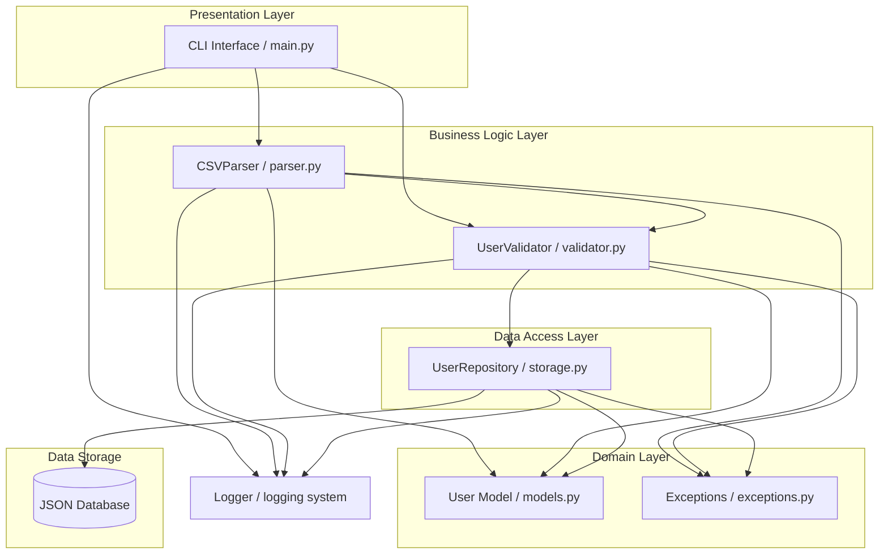

# System Architecture

## Overview
Resilient Data Importer follows a layered architecture with separation of concerns.

## Layers
1. **CLI Layer**: `main.py` – User interaction.
2. **Business Logic Layer**: `parser.py`, `validator.py` – Parsing and validation.
3. **Data Access Layer**: `storage.py` – JSON storage.
4. **Domain Layer**: `models.py`, `exceptions.py` – Data structures & exceptions.
5. **Infrastructure Layer**: Logging system, file I/O.

## Architecture Diagram 

