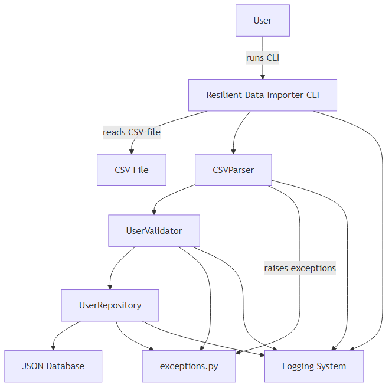

# System Architecture

## Overview
The Resilient Data Importer follows a layered architecture with clear separation of concerns.

## Architecture Diagram
See: `diagrams/architecture.png`

## Layers

### 1. CLI Layer
**Responsibility**: User interaction
**Components**: 
- `main.py` - Entry point, argument parsing

### 2. Business Logic Layer
**Responsibility**: Core application logic
**Components**:
- `parser.py` - CSV parsing
- `validator.py` - Data validation
- `storage.py` - Data persistence

### 3. Data Layer
**Responsibility**: Data structures and exceptions
**Components**:
- `models.py` - User dataclass
- `exceptions.py` - Custom exceptions

### 4. Infrastructure Layer
**Responsibility**: External interactions
**Components**:
- File system (CSV, JSON)
- Logging system

## Component Interactions
User Input → CLI → Parser → Validator → Storage → JSON Database
↓         ↓          ↓
Logger ← Logger ← Logger
↓         ↓          ↓
Exceptions → Console
## Design Patterns Used

### Repository Pattern
**Where**: `storage.py`
**Why**: Abstracts data access logic

### Context Manager Pattern
**Where**: `DatabaseContext` in `storage.py`
**Why**: Ensures proper resource cleanup

### Factory Pattern
**Where**: User creation in `parser.py`
**Why**: Centralizes object creation logic

## Data Flow

1. **Input**: User runs CLI command with CSV file
2. **Parse**: CSV parsed into rows
3. **Validate**: Each row validated for correctness
4. **Check**: Duplicate check against database
5. **Store**: Valid, unique users saved to JSON
6. **Output**: Summary displayed to user

## Error Handling Strategy

All errors inherit from `ImporterError` base class.
Errors are caught at the CLI layer and displayed to user.
All errors are logged with appropriate severity.

