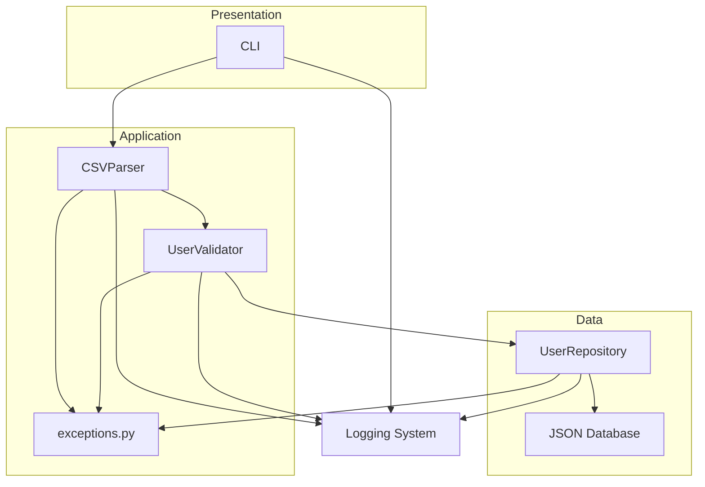

```mermaid
graph TD
subgraph Presentation
    CLI[CLI]
end

subgraph Application
    Parser[CSVParser]
    Validator[UserValidator]
    Exceptions[exceptions.py]
end

subgraph Data
    Repository[UserRepository]
    JSONDB[JSON Database]
end

Logger[Logging System]

CLI --> Parser
Parser --> Validator
Validator --> Repository
Repository --> JSONDB

Parser --> Exceptions
Validator --> Exceptions
Repository --> Exceptions

CLI --> Logger
Parser --> Logger
Validator --> Logger
Repository --> Logger
```