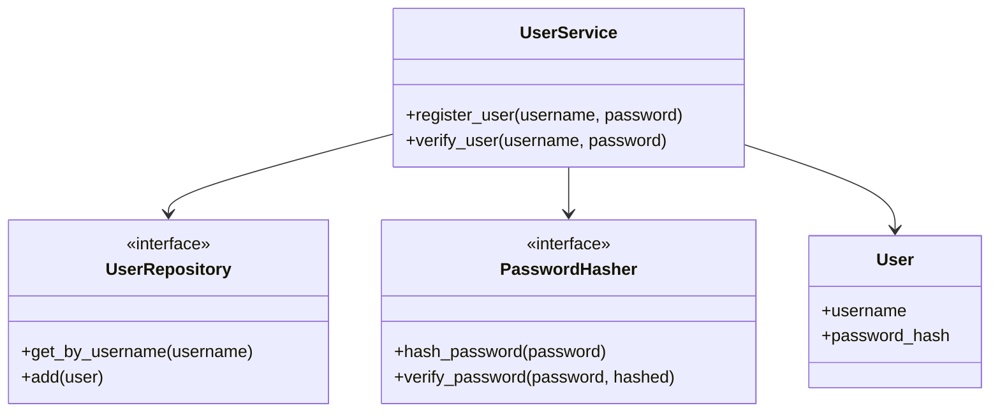

# Architecture Overview

## Principles

- **SOLID**: Single Responsibility, Open/Closed, Liskov Substitution, Interface Segregation, Dependency Inversion
- **Dependency Injection**: `UserService` depends on abstract interfaces (`UserRepository`, `PasswordHasher`) to allow testability and modularity
- **TDD**: Red → Green → Refactor workflow
- **Security**: Passwords are hashed with bcrypt; plain passwords are never stored
- **Logging**: Structured logging for registration and login events

---

## Class & Component Diagram

### Component Descriptions

- **UserService**: Main entry point for registration and login operations
- **UserRepository**: Abstract storage layer (in-memory or other future implementations)
- **PasswordHasher**: Abstract hashing layer (bcrypt implementation)
- **User**: Data model representing a registered user

---

## Workflow

### Register User

1. `UserService` checks if username exists via `UserRepository`
2. Password is hashed via `PasswordHasher`
3. `User` object is stored in repository

### Verify User

1. `UserService` retrieves user via `UserRepository`
2. Password is verified via `PasswordHasher`

---

## Benefits of This Architecture

- **Testability**: Dependencies can be mocked/stubbed for unit testing
- **Modularity**: Easy to swap implementations (e.g., database vs in-memory storage)
- **Security**: Password handling is centralized and follows best practices
- **Maintainability**: Clear separation of concerns makes code easier to understand and modify