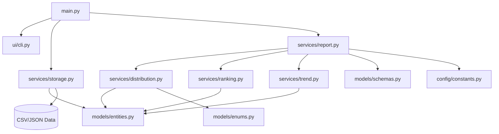

# Project Architecture

This document describes the high-level architecture of the Student Grade Analytics Tool.

## Component Overview

The tool follows a modular architecture with a clean separation between data definitions, business services, and the user interface.

## System Components

### 1. Model Layer (`src/models/`)
Defines the structure of the data using `dataclasses` and `TypedDict`.

- **`entities.py`**: Core entities like `Student`, `Course`, and `Grade` using `@dataclass`.
- **`enums.py`**: `GradeCategory` for fixed grading standards.
- **`schemas.py`**: `TypedDict` for JSON report structure and validation.

### 2. Services Layer (`src/services/`)
Contains the business logic decoupled from data structures.

- **`distribution.py`**: Grade frequency and grouping logic using `Counter` and `defaultdict`.
- **`ranking.py`**: Student ranking logic (percentiles, top performers).
- **`report.py`**: Report aggregation logic using `OrderedDict`.
- **`trend.py`**: Historical trend analysis using `deque` for rolling averages.
- **`storage.py`**: Disk I/O operations using `pathlib` and context managers.

### 3. Entry Point & UI
- **`main.py`**: Orchestrates the workflow: Read -> Process -> Write.
- **`ui/cli.py`**: Handles user feedback and reporting to the console.

---

## Data Flow
1. **Input**: `StorageService` reads `data/students.csv` into `Student` objects.
2. **Processing**: `ReportService` coordinates various logic from the `services/` layer.
3. **Output**: `StorageService` writes the `GradeAnalyticsReport` (TypedDict) to `data/report.json`.
4. **Display**: Progress and errors are routed through `cli.py`.
