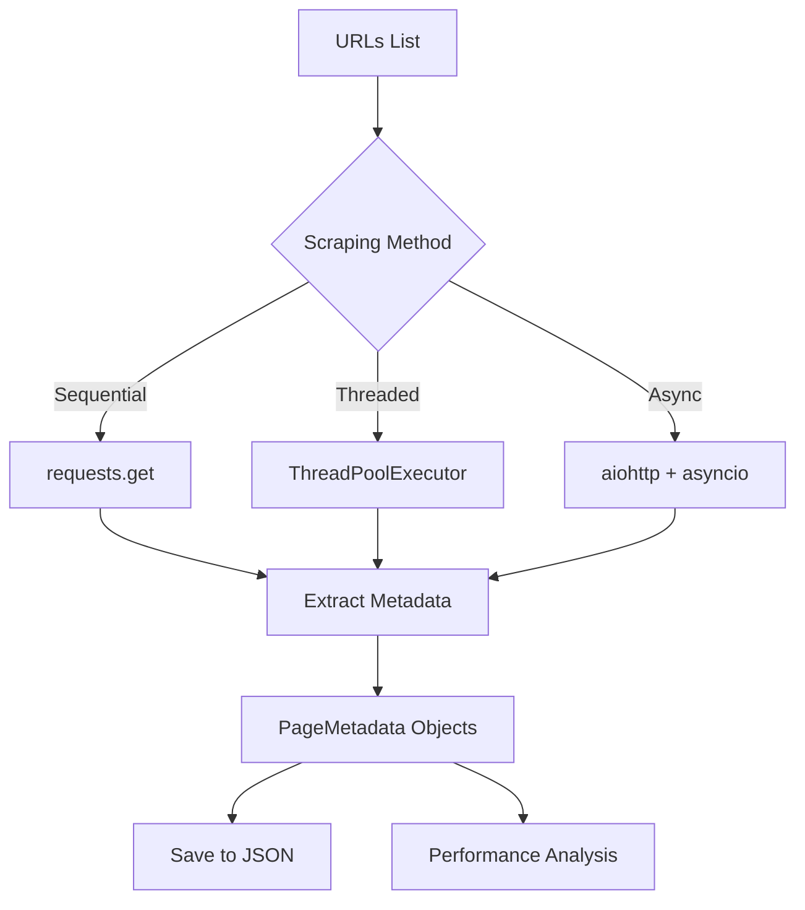

# Architecture Overview

## System Design

The Async Web Scraper is designed with modularity and performance in mind. It demonstrates three different concurrency models and compares their effectiveness for I/O-bound web scraping tasks.

## Components

### 1. Core Scraper (`scraper.py`)

**Purpose**: Implements three scraping strategies with identical functionality but different concurrency models.

**Key Classes**:
- `PageMetadata`: Dataclass storing extracted metadata (title, description, status, timing, errors)

**Key Functions**:
- `scrape_sequential()`: Synchronous scraping using `requests`
- `scrape_threaded()`: Concurrent scraping using `ThreadPoolExecutor`
- `scrape_async()`: Asynchronous scraping using `asyncio` and `aiohttp`
- `extract_metadata_from_html()`: Parses HTML to extract page metadata

**Design Patterns**:
- **Strategy Pattern**: Three interchangeable scraping strategies
- **Dataclass Pattern**: Structured data representation with `PageMetadata`

### 2. Utilities (`utils.py`)

**Purpose**: Reusable async utilities and decorators.

**Decorators**:
- `@retry(max_attempts, delay)`: Automatic retry logic with exponential backoff
- `@log_execution`: Execution time tracking and logging

**Async Generators**:
- `async_response_generator()`: Yields responses asynchronously
- `async_batch_processor()`: Processes items in batches

### 3. Main Entry Point (`main.py`)

**Purpose**: Orchestrates scraper execution, benchmarking, and result reporting.

**Key Functions**:
- `run_sequential_scraper()`: Executes and times sequential scraping
- `run_threaded_scraper()`: Executes and times threaded scraping
- `run_async_scraper()`: Executes and times async scraping
- `print_performance_comparison()`: Displays comparative results
- `save_results_to_json()`: Persists results to JSON files

## Concurrency Models

### Sequential Model
```
Request 1 → Wait → Response 1 → Request 2 → Wait → Response 2 → ...
```
- **Pros**: Simple, predictable
- **Cons**: Slow, inefficient for I/O-bound tasks

### Threaded Model
```
Thread 1: Request 1 → Wait → Response 1
Thread 2: Request 2 → Wait → Response 2
Thread 3: Request 3 → Wait → Response 3
...
```
- **Pros**: Concurrent execution, familiar paradigm
- **Cons**: Thread overhead, GIL limitations, higher memory usage

### Async Model
```
Event Loop:
  Task 1: Request 1 → (await) → Response 1
  Task 2: Request 2 → (await) → Response 2
  Task 3: Request 3 → (await) → Response 3
  ...
```
- **Pros**: Highly efficient, low overhead, scalable
- **Cons**: Requires async-compatible libraries, different mental model

## Data Flow



## Error Handling Strategy

1. **Request Level**: Try-except blocks catch individual request failures
2. **Retry Logic**: `@retry` decorator automatically retries failed requests
3. **Graceful Degradation**: Failed requests return `PageMetadata` with error information
4. **Timeout Protection**: `asyncio.wait_for()` prevents hanging requests

## Performance Optimization

1. **Semaphore Rate Limiting**: Controls concurrent requests to avoid overwhelming servers
2. **Connection Pooling**: `aiohttp.ClientSession` reuses connections
3. **Batch Processing**: Async generators enable efficient batch processing
4. **Minimal Blocking**: All I/O operations use async/await

## Testing Strategy

- **Unit Tests**: Test individual functions and decorators
- **Integration Tests**: Test complete scraping workflows
- **Mock Testing**: Use mocks to avoid actual network requests during testing
- **Async Testing**: `pytest-asyncio` for testing async functions
