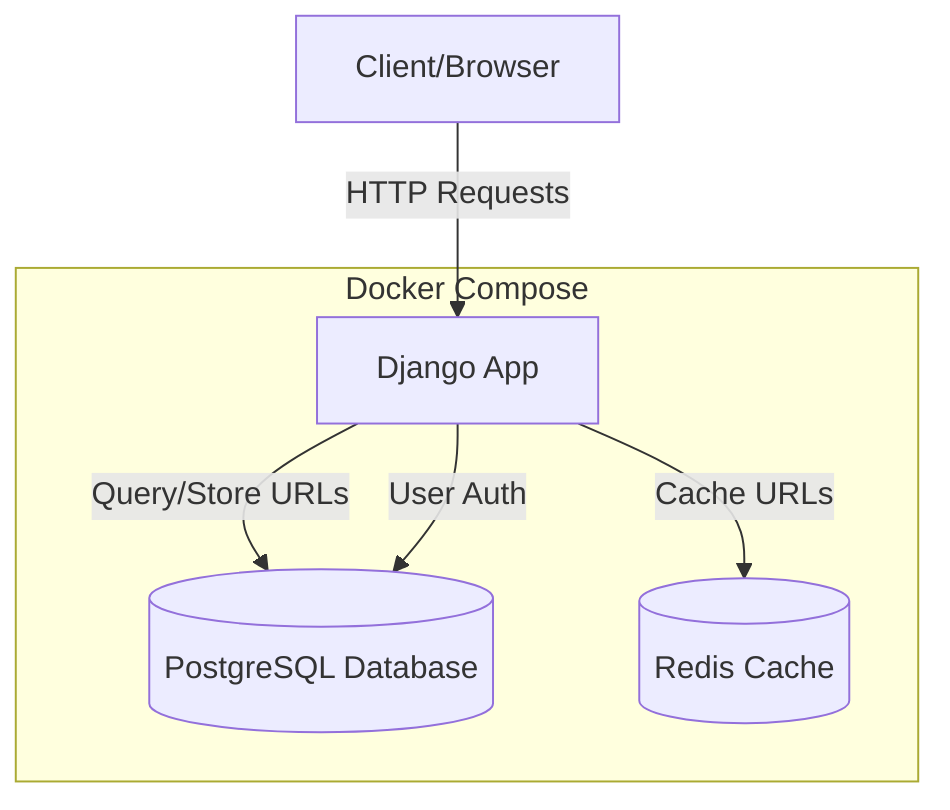
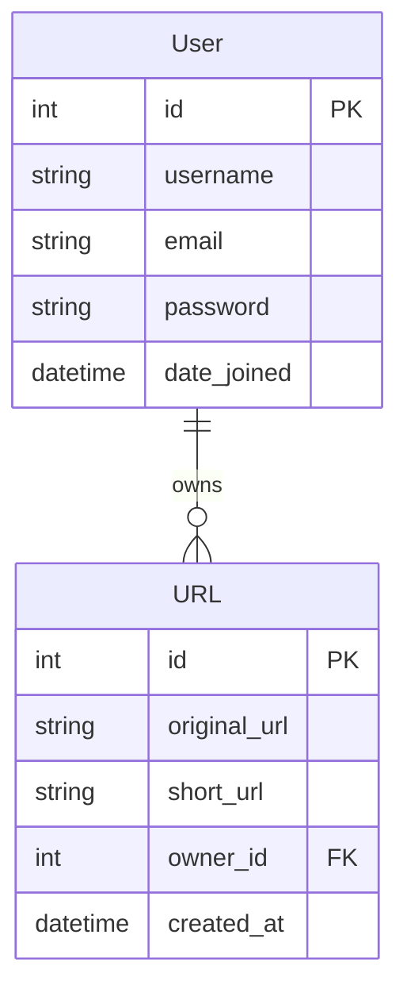

# Module 6: URL Shortener with PostgreSQL & User Accounts

A URL shortener microservice with **PostgreSQL database** and **user account management**. Built with Django REST Framework and fully containerized with Docker.

## Architecture



### Database Schema



## Quick Start

### Run with Docker (Recommended)

```bash
# Navigate to module
cd module6

# Start all services
docker-compose up -d

# Run migrations
docker exec -it url_shortener_web python manage.py migrate

# Create superuser (optional)
docker exec -it url_shortener_web python manage.py createsuperuser

# Access the app
# Swagger UI: http://localhost:8000/api/schema/swagger-ui/
# Admin: http://localhost:8000/admin/
```

### Run Locally (Without Docker)

```bash
# Create virtual environment
python -m venv venv
venv\Scripts\activate  # Windows

# Install dependencies
pip install -r requirements.txt

# Set up PostgreSQL (ensure it's running)
# Update .env with your PostgreSQL credentials

# Run migrations
cd url
python manage.py migrate

# Create superuser
python manage.py createsuperuser

# Start server
python manage.py runserver

# Access: http://127.0.0.1:8000/api/schema/swagger-ui/
```

## Key Features

- **PostgreSQL Database**: Production-ready relational database
- **User Accounts**: Custom User model with registration
- **URL Ownership**: Each URL belongs to a user
- **Redis Caching**: Fast URL lookups
- **REST API**: Full CRUD operations
- **Swagger UI**: Interactive API documentation
- **Docker**: Complete containerization

## API Endpoints

| Method | Endpoint | Description | Auth Required |
|--------|----------|-------------|---------------|
| POST | `/api/shorten/` | Create short URL | No |
| GET | `/{short_code}/` | Redirect to original URL | No |
| GET | `/api/schema/swagger-ui/` | API documentation | No |
| GET | `/admin/` | Admin panel | Yes (Staff) |

## Technology Stack

- **Framework**: Django 6.0 + Django REST Framework
- **Database**: PostgreSQL 15
- **Cache**: Redis 7
- **API Docs**: drf-spectacular
- **Containerization**: Docker & Docker Compose

## Project Structure

```
module6/
├── url/
│   ├── accounts/          # User management app
│   │   ├── models.py      # Custom User model
│   │   └── admin.py
│   ├── api/               # REST API endpoints
│   │   ├── views.py
│   │   ├── serializers.py
│   │   └── urls.py
│   ├── shortener/         # Core URL shortening logic
│   │   ├── models.py      # URL model
│   │   └── services.py
│   └── url/               # Project settings
│       └── settings.py    # PostgreSQL config
├── docker-compose.yml     # Orchestration
└── Dockerfile
```

## Database Inspection

```bash
# Connect to PostgreSQL
docker exec -it url_shortener_postgres psql -U postgres -d module6_db

# View users
SELECT id, username, email FROM accounts_user;

# View URLs with owners
SELECT url.short_url, url.original_url, u.username
FROM shortener_url url
JOIN accounts_user u ON url.owner_id = u.id;

# Exit
\q
```

## Troubleshooting

**Database connection error:**
```bash
# Ensure PostgreSQL is running
docker-compose ps

# Check logs
docker-compose logs db
```

**Migrations not applied:**
```bash
docker exec -it url_shortener_web python manage.py migrate
```

---

**Module 6 Complete!**   *Next: Module 7 - Authentication & Authorization*
