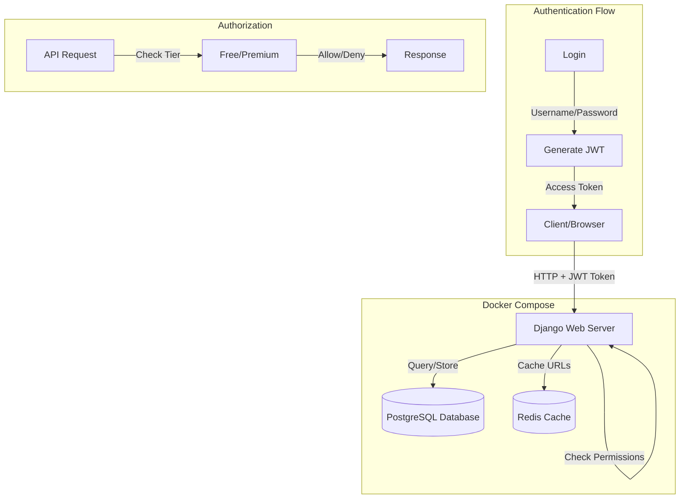
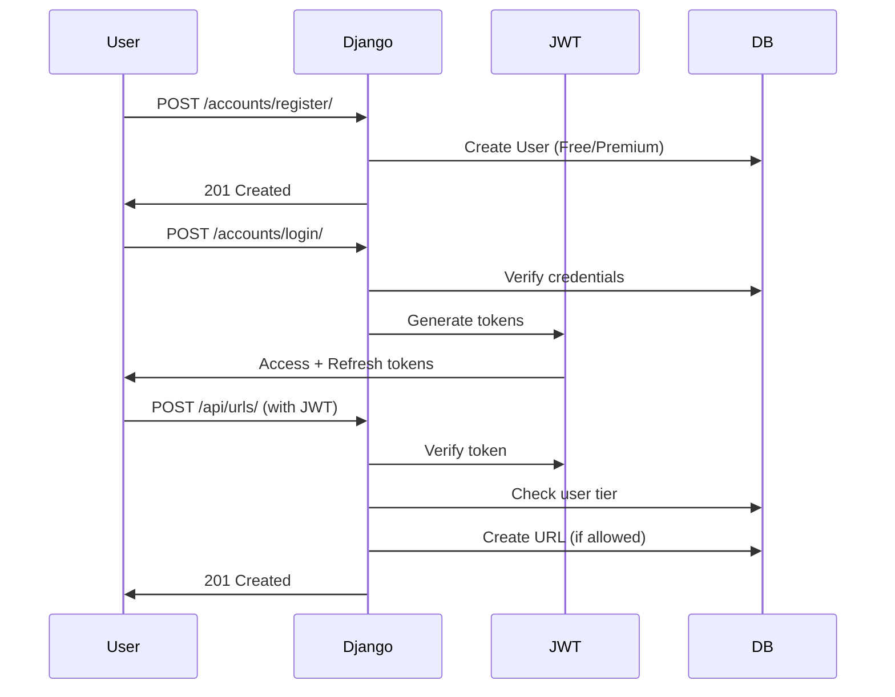

# Module 7: URL Shortener with Authentication & Authorization

A production-ready URL shortener with **JWT authentication**, **role-based access control (RBAC)**, and **tiered user system** (Free/Premium). Built with Django REST Framework and fully containerized with Docker.

##  Architecture



### Authentication Flow



##  Quick Start

### Run with Docker (Recommended)

```bash
# Navigate to module
cd module7/url

# Start all services (web, db, redis)
docker-compose up -d

# Run migrations
docker exec -it url_shortener_web python manage.py migrate

# Create superuser
docker exec -it url_shortener_web python manage.py createsuperuser

# Access the app
# Swagger UI: http://localhost:8000/api/schema/swagger-ui/
# Admin: http://localhost:8000/admin/
```

### Test the API

```bash
# 1. Register a user
curl -X POST http://localhost:8000/accounts/register/ \
  -H "Content-Type: application/json" \
  -d '{"username":"testuser","email":"test@example.com","password":"SecurePass123!","password_confirm":"SecurePass123!","is_premium":false}'

# 2. Login to get JWT token
curl -X POST http://localhost:8000/accounts/login/ \
  -H "Content-Type: application/json" \
  -d '{"username":"testuser","password":"SecurePass123!"}'

# 3. Create short URL (use access token from step 2)
curl -X POST http://localhost:8000/api/urls/ \
  -H "Content-Type: application/json" \
  -H "Authorization: Bearer YOUR_ACCESS_TOKEN" \
  -d '{"original_url":"https://www.example.com"}'
```

##  Key Features

### Authentication & Security
- **JWT Tokens**: Access and refresh tokens
- **User Registration**: Email validation, password hashing
- **Rate Limiting**: 5 login attempts/minute
- **Secure Passwords**: PBKDF2 hashing with salt

### Authorization & RBAC
- **Custom Permissions**: `IsOwnerOrReadOnly`
- **Tiered Users**: Free and Premium tiers
- **Business Logic**: Automatic tier-based restrictions

### Tier-Based Features

| Feature | Free Users | Premium Users |
|---------|-----------|---------------|
| Max Active URLs | 10 | Unlimited |
| Custom Aliases | ❌ | ✅ |
| Detailed Analytics | ❌ | ✅ |
| Click Tracking | ✅ | ✅ |

##  API Endpoints

| Method | Endpoint | Description | Auth Required |
|--------|----------|-------------|---------------|
| POST | `/accounts/register/` | Register user | No |
| POST | `/accounts/login/` | Login (get JWT) | No |
| POST | `/accounts/token/refresh/` | Refresh access token | No |
| POST | `/api/urls/` | Create short URL | Yes |
| GET | `/{short_code}/` | Redirect to original URL | No |
| GET | `/api/schema/swagger-ui/` | API documentation | No |

## Technology Stack

- **Framework**: Django 5.0 + Django REST Framework
- **Authentication**: djangorestframework-simplejwt 5.3
- **Database**: PostgreSQL 15
- **Cache**: Redis 7
- **API Docs**: drf-spectacular
- **Containerization**: Docker & Docker Compose

## Project Structure

```
module7/url/
├── accounts/              # Authentication app
│   ├── models.py         # Custom User model (tier field)
│   ├── serializers.py    # Login, Register serializers
│   ├── views.py          # Login, Register views
│   ├── urls.py           # Auth endpoints
│   └── throttling.py     # Rate limiting
├── api/                   # REST API endpoints
│   ├── serializers.py    # URL serializers
│   ├── views.py          # URL CRUD views
│   ├── urls.py           # API endpoints
│   └── permissions.py    # IsOwnerOrReadOnly
├── shortener/             # Core business logic
│   ├── models.py         # URL, Click, Tag models
│   ├── services.py       # UrlShortenerService
│   └── admin.py
├── url/
│   ├── settings.py       # JWT & Redis config
│   └── urls.py
├── docker-compose.yml     # 3 services: web, db, redis
└── Dockerfile
```

## Database Inspection

```bash
# Connect to PostgreSQL
docker exec -it url_shortener_postgres psql -U postgres -d module7_db

# View users with tiers
SELECT id, username, email, is_premium, tier FROM accounts_user;

# View URLs with owner info
SELECT url.short_url, url.original_url, u.username, u.is_premium
FROM shortener_url url
JOIN accounts_user u ON url.owner_id = u.id;

# Count URLs per user (check Free user limit)
SELECT u.username, u.tier, COUNT(url.id) as url_count
FROM accounts_user u
LEFT JOIN shortener_url url ON u.id = url.owner_id
GROUP BY u.username, u.tier;

# View click tracking
SELECT url.short_url, c.country, COUNT(*) as clicks
FROM shortener_click c
JOIN shortener_url url ON c.url_id = url.id
GROUP BY url.short_url, c.country;

# Exit
\q
```

## Testing Business Logic

### Test Free User Limits

```bash
# 1. Register as Free user
# 2. Create 10 URLs (should succeed)
# 3. Try to create 11th URL (should fail with error message)
# Expected: "Free users can only create up to 10 active URLs."
```

### Test Premium Features

```bash
# 1. Register as Premium user (is_premium: true)
# 2. Create URL with custom alias
# Expected: Custom alias works, detailed_stats visible

# 3. Register as Free user
# 4. Try custom alias
# Expected: Error - "Only premium users can set custom aliases"
```

### Test Rate Limiting

```bash
# Try 6 failed logins within 1 minute
# Expected: 6th attempt returns 429 Too Many Requests
```

## JWT Token Management

```bash
# Login returns two tokens
{
  "refresh": "eyJ0eXAiOiJKV1QiLCJhbGc...",  # Valid for 1 day
  "access": "eyJ0eXAiOiJKV1QiLCJhbGc..."   # Valid for 5 minutes
}

# Use access token in requests
Authorization: Bearer <access_token>

# Refresh when access token expires
curl -X POST http://localhost:8000/accounts/token/refresh/ \
  -H "Content-Type: application/json" \
  -d '{"refresh":"YOUR_REFRESH_TOKEN"}'
```

## Troubleshooting

**JWT token invalid:**
```bash
# Check token hasn't expired
# Ensure "Bearer " prefix in Authorization header
# Verify SECRET_KEY matches between requests
```

**Rate limiting not working:**
```bash
# Check Redis is running
docker-compose ps redis

# Test Redis connection
docker exec -it url_shortener_redis redis-cli PING
```

**Free user can create >10 URLs:**
```bash
# Check business logic in api/views.py
# Verify tier field in User model
# Check URL count query
```

## Monitor Redis Cache

```bash
# Connect to Redis
docker exec -it url_shortener_redis redis-cli

# View cached URLs
KEYS url:*

# View rate limiting data
KEYS login_throttle:*
GET login_throttle:testuser

# Exit
EXIT
```

---

**Module 7 Complete!** 🎉 *Next: Module 8 - Celery & Logging*
