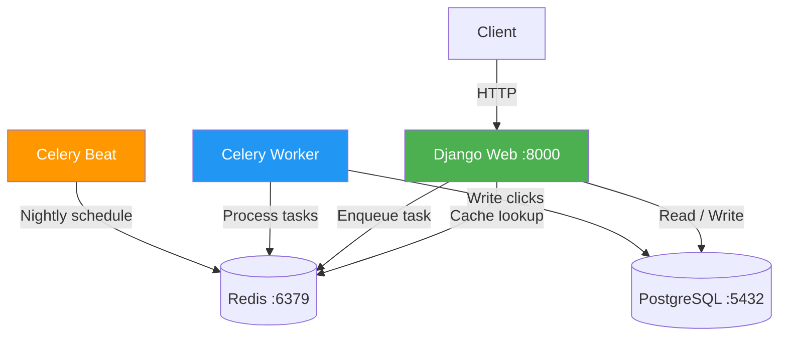

# Module 8: URL Shortener — Production Ready

A production-ready URL shortener built with **Django REST Framework**, **Redis caching**, **Celery async tasks**, **JWT auth**, **pagination**, **analytics**, and **structured JSON logging** — fully containerised with Docker.

---

## 🏗️ Architecture



**Request flows:**
1. **URL creation** → Web → Postgres → warm Redis cache
2. **Redirect** → Web → Redis hit → instant 302 (no DB) → Celery task logs click
3. **Redirect (cache miss)** → Web → Postgres → fill Redis → 302 → Celery logs click
4. **Nightly cleanup** → Celery Beat → Worker → deactivate expired URLs in Postgres

---

## 🐳 Docker Setup (5 containers)

| Container | Image | Port | Role |
|---|---|---|---|
| `url_shortener_web` | app image | 8000 | Django API |
| `url_shortener_postgres` | postgres:15 | 5432 | Database |
| `url_shortener_redis` | redis:7 | 6379 | Cache + Celery broker |
| `url_shortener_celery_worker` | app image | — | Async task processor |
| `url_shortener_celery_beat` | app image | — | Periodic task scheduler |

### Step 1 — Environment file

The `.env` file is already present. Key variables:

```env
POSTGRES_DB=module7_db
POSTGRES_USER=postgres
POSTGRES_PASSWORD=postgres
REDIS_LOCATION=redis://redis:6379/1
DEBUG=True
SECRET_KEY=django-insecure-super-secret-key
```

### Step 2 — Build & start all containers

```bash
cd module8/url

# Build images and start all 5 containers in background
docker-compose up -d --build

# Verify all 5 are running
docker-compose ps
```

### Step 3 — Run migrations & create superuser

```bash
docker exec -it url_shortener_web python manage.py migrate
docker exec -it url_shortener_web python manage.py createsuperuser
```

### Step 4 — Useful management commands

```bash
# Live API logs
docker-compose logs -f web

# Live Celery worker logs (see click tracking)
docker-compose logs -f celery_worker

# Live Celery beat logs (see scheduled tasks)
docker-compose logs -f celery_beat

# Restart a single service
docker-compose restart web

# Full reset (removes DB & Redis volumes)
docker-compose down -v
```

---

## 🔗 Service URLs

| Service | URL |
|---|---|
| **Swagger UI** | http://localhost:8000/api/schema/swagger-ui/ |
| **ReDoc** | http://localhost:8000/api/schema/redoc/ |
| **Health Check** | http://localhost:8000/api/health/ |
| **Admin Panel** | http://localhost:8000/admin/ |

---

## 📡 API Endpoints Reference

### Authentication (`/accounts/`)

| Method | Endpoint | Auth | Description |
|---|---|---|---|
| POST | `/accounts/register/` | — | Register a new user |
| POST | `/accounts/login/` | — | Login → get JWT tokens |
| POST | `/accounts/token/refresh/` | — | Refresh access token |

### URL Management (`/api/urls/`)

| Method | Endpoint | Auth | Description |
|---|---|---|---|
| GET | `/api/urls/` | ✅ | List my URLs (paginated, filterable) |
| POST | `/api/urls/` | ✅ | Create a short URL |
| GET | `/api/urls/{short_code}/` | ✅ | Retrieve a single URL |
| PUT | `/api/urls/{short_code}/` | ✅ | Update a URL (partial update) |
| DELETE | `/api/urls/{short_code}/` | ✅ | Soft-delete a URL |

### Redirect (Public)

| Method | Endpoint | Auth | Description |
|---|---|---|---|
| GET | `/{short_code}/` | — | Redirect to original URL (302) |

### Analytics

| Method | Endpoint | Auth | Description |
|---|---|---|---|
| GET | `/api/analytics/{short_code}/` | ✅ | Click stats. Premium: includes recent clicks |

### Tags

| Method | Endpoint | Auth | Description |
|---|---|---|---|
| GET | `/api/tags/` | ✅ | List all available tag names |

### Monitoring

| Method | Endpoint | Auth | Description |
|---|---|---|---|
| GET | `/api/health/` | — | DB + Redis status |

---

## 🧪 Testing All Endpoints

### Option A — Swagger UI (recommended)

1. Open http://localhost:8000/api/schema/swagger-ui/
2. Register → Login → copy the `access` token
3. Click **Authorize** → enter `Bearer <your_access_token>`
4. Use every endpoint interactively

---

### Option B — curl

#### 1. Register

```bash
curl -X POST http://localhost:8000/accounts/register/ \
  -H "Content-Type: application/json" \
  -d '{
    "username": "testuser",
    "email": "user@example.com",
    "password": "SecurePass123!",
    "password_confirm": "SecurePass123!",
    "is_premium": false
  }'
```

#### 2. Login → get tokens

```bash
curl -X POST http://localhost:8000/accounts/login/ \
  -H "Content-Type: application/json" \
  -d '{"username": "testuser", "password": "SecurePass123!"}'
# Response: {"access": "eyJ...", "refresh": "eyJ..."}
```

Save your token:
```bash
TOKEN="eyJ..."   # paste your access token here
```

#### 3. Create a short URL (free user)

```bash
curl -X POST http://localhost:8000/api/urls/ \
  -H "Authorization: Bearer $TOKEN" \
  -H "Content-Type: application/json" \
  -d '{"original_url": "https://www.github.com"}'
# Response includes short_url e.g. "aB3xYz"
```

#### 4. Create a short URL with custom alias (premium only)

```bash
curl -X POST http://localhost:8000/api/urls/ \
  -H "Authorization: Bearer $TOKEN" \
  -H "Content-Type: application/json" \
  -d '{"original_url": "https://www.github.com", "custom_alias": "my-github"}'
```

#### 5. List my URLs — Pagination

```bash
# Page 1 (default page size = 20)
curl http://localhost:8000/api/urls/ \
  -H "Authorization: Bearer $TOKEN"

# Response shape:
# {
#   "count": 45,
#   "next": "http://localhost:8000/api/urls/?page=2",
#   "previous": null,
#   "results": [...]
# }

# Page 2
curl "http://localhost:8000/api/urls/?page=2" \
  -H "Authorization: Bearer $TOKEN"
```

#### 6. List my URLs — Search & Tag filter

```bash
# Search by original URL (case-insensitive)
curl "http://localhost:8000/api/urls/?search=github" \
  -H "Authorization: Bearer $TOKEN"

# Filter by tag name (case-insensitive)
curl "http://localhost:8000/api/urls/?tag=social" \
  -H "Authorization: Bearer $TOKEN"

# Combine both
curl "http://localhost:8000/api/urls/?search=github&tag=social" \
  -H "Authorization: Bearer $TOKEN"
```

#### 7. Retrieve a single URL

```bash
curl http://localhost:8000/api/urls/aB3xYz/ \
  -H "Authorization: Bearer $TOKEN"
```

#### 8. Update a URL (partial — any fields)

```bash
# Toggle active status
curl -X PUT http://localhost:8000/api/urls/aB3xYz/ \
  -H "Authorization: Bearer $TOKEN" \
  -H "Content-Type: application/json" \
  -d '{"is_active": false}'

# Reset click counter
curl -X PUT http://localhost:8000/api/urls/aB3xYz/ \
  -H "Authorization: Bearer $TOKEN" \
  -H "Content-Type: application/json" \
  -d '{"reset_clicks": true}'

# Update original URL + set expiry
curl -X PUT http://localhost:8000/api/urls/aB3xYz/ \
  -H "Authorization: Bearer $TOKEN" \
  -H "Content-Type: application/json" \
  -d '{"original_url": "https://new-url.com", "expires_at": "2026-12-31T00:00:00Z"}'
```

#### 9. Tags — list available & assign to URLs

```bash
# First: see all available tag names
curl http://localhost:8000/api/tags/ \
  -H "Authorization: Bearer $TOKEN"
# ["Marketing", "Newsletter", "Personal", "Social Media"]

# Create a URL and assign tags at the same time
curl -X POST http://localhost:8000/api/urls/ \
  -H "Authorization: Bearer $TOKEN" \
  -H "Content-Type: application/json" \
  -d '{"original_url": "https://twitter.com/me", "tags": ["Social Media", "Marketing"]}'

# Replace tags on an existing URL
curl -X PUT http://localhost:8000/api/urls/aB3xYz/ \
  -H "Authorization: Bearer $TOKEN" \
  -H "Content-Type: application/json" \
  -d '{"tags": ["Newsletter"]}'

# Remove all tags from a URL
curl -X PUT http://localhost:8000/api/urls/aB3xYz/ \
  -H "Authorization: Bearer $TOKEN" \
  -H "Content-Type: application/json" \
  -d '{"tags": []}'

# Filter URLs by tag (case-insensitive partial match)
curl "http://localhost:8000/api/urls/?tag=social" \
  -H "Authorization: Bearer $TOKEN"
```

> **Note:** Tag names must match exactly what `GET /api/tags/` returns.
> Sending an unknown tag returns `400` with a list of valid options.

#### 10. Soft-delete a URL

```bash
curl -X DELETE http://localhost:8000/api/urls/aB3xYz/ \
  -H "Authorization: Bearer $TOKEN"
# Returns: 204 No Content
```

#### 10. Public redirect (triggers async click tracking)

```bash
# Follow the redirect (-L flag)
curl -L http://localhost:8000/aB3xYz/

# Without following redirect (just see the 302 header)
curl -I http://localhost:8000/aB3xYz/
```

#### 11. Analytics — click aggregation by country

```bash
# All users see clicks_by_country
curl http://localhost:8000/api/analytics/aB3xYz/ \
  -H "Authorization: Bearer $TOKEN"

# Response:
# {
#   "url": "aB3xYz",
#   "total_clicks": 42,
#   "clicks_by_country": [
#     {"country": "RW", "total_clicks": 30},
#     {"country": "US", "total_clicks": 12}
#   ]
# }

# Premium users also get "recent_clicks" (last 20 with IP, user_agent, timestamp)
```

#### 12. Health check

```bash
curl http://localhost:8000/api/health/
# {"database": "ok", "cache": "ok"}   → 200
# {"database": "error: ...", ...}      → 503
```

---

## ⚙️ Celery — Async & Scheduled Tasks

### How it works

When a user hits `/{short_code}/`, the app:
1. Serves the **302 redirect immediately** (from Redis or DB)
2. Fires `track_click_task.delay(...)` — a **non-blocking Celery task**
3. The Celery Worker processes the task asynchronously:
   - Creates a `Click` record in Postgres
   - Increments `url.click_count` with an atomic `F()` update

### Verifying async click tracking

```bash
# 1. Hit a short URL
curl -L http://localhost:8000/aB3xYz/

# 2. Watch worker logs for confirmation
docker-compose logs -f celery_worker
# You should see: "Click tracked successfully" {"url_id": 1, "ip": "..."}
```

### Periodic task — nightly URL cleanup

**Celery Beat** schedules `cleanup_expired_urls` (defined in `shortener/tasks.py`) to run nightly. It deactivates all URLs where `expires_at` < now.

```bash
# Watch Beat scheduling
docker-compose logs -f celery_beat

# Manually trigger cleanup from Django shell
docker exec -it url_shortener_web python manage.py shell -c "
from shortener.tasks import cleanup_expired_urls
result = cleanup_expired_urls.delay()
print(result.get())
"
```

### Configure the Beat schedule (via Admin)

1. Open http://localhost:8000/admin/
2. Go to **Periodic Tasks** → **Add**
3. Set task `shortener.tasks.cleanup_expired_urls`, crontab = `0 0 * * *` (midnight)

---

## 🏛️ Service / Architecture Layer

Business logic is cleanly separated into three layers:

| Layer | File | Responsibility |
|---|---|---|
| **Serializer** | `api/serializers.py` | Input validation & response shaping only |
| **View** | `api/views.py` | HTTP handling, auth checks, pagination |
| **Service** | `shortener/services.py` | All business rules (limits, mutations, queries) |

Key service methods:
- `create_short_url()` — enforces free-user limits & custom alias rules
- `update_url()` — handles `reset_clicks` flag
- `deactivate_url()` — soft-delete
- `get_click_stats()` — aggregated analytics queries

---

## 📁 Project Structure

```
module8/url/
├── accounts/           # Registration, login, JWT auth, rate limiting
├── api/                # REST endpoints, serializers, URL routing
│   ├── views.py        # All API views (paginated list, CRUD, analytics)
│   ├── serializers.py  # Pure data contracts — no business logic
│   └── urls.py         # API URL patterns
├── shortener/          # Core app
│   ├── models.py       # Url, Click, Tag models
│   ├── services.py     # Business logic layer
│   ├── tasks.py        # Celery tasks (click tracking + cleanup)
│   └── tests.py        # Unit tests (service layer)
├── core/               # Health check view + short code generator
├── url/                # Django settings, Celery config, main URL router
├── logs/               # JSON log files (app.log, errors.log)
├── docker-compose.yml  # 5 services
├── Dockerfile
├── .env
└── requirements.txt
```

---

## 📊 Structured JSON Logging

Every action is logged in JSON format, parseable by tools like ELK / Datadog:

```json
{"asctime": "2026-02-23 12:00:00", "name": "api.views", "levelname": "INFO",
 "message": "URL created successfully", "url_id": 1, "short_code": "aB3xYz", "user": "testuser"}

{"asctime": "2026-02-23 12:00:01", "name": "shortener.tasks", "levelname": "INFO",
 "message": "Click tracked successfully", "url_id": 1, "ip": "192.168.1.1"}
```

```bash
# View combined logs from all containers
docker-compose logs -f

# View live app logs in real-time
docker-compose logs -f web

# View Celery worker logs (to see click tracking)
docker-compose logs -f celery_worker

# View logs in the local directory (persistent)
cat logs/app.log
cat logs/errors.log

# Live tail inside container
docker exec -it url_shortener_web tail -f logs/app.log
```

---

## 🔒 Security Features

- JWT access tokens (15 min) + refresh tokens (1 day)
- PBKDF2 password hashing
- Rate limiting on login — max **5 requests/minute**
- Owner-based permissions (users only access their own URLs)
- Input validation on all endpoints

---

## ✅ Module 8 Learning Outcomes

| Feature | Status |
|---|---|
| Redis cache-first redirect strategy | ✅ |
| Cache warming on URL creation | ✅ |
| Cache invalidation on URL update/delete | ✅ |
| Celery async task (write-behind click tracking) | ✅ |
| Celery Beat periodic task (nightly cleanup) | ✅ |
| Paginated URL list (`?page=N`, page_size=20) | ✅ |
| Search filter (`?search=`) | ✅ |
| Tag filter (`?tag=`) | ✅ |
| Analytics aggregation by country | ✅ |
| Premium-gated recent clicks | ✅ |
| Business logic separated into service layer | ✅ |
| Structured JSON logging | ✅ |
| Docker multi-container orchestration | ✅ |
| Health check endpoint | ✅ |

---

**Author**: Ishimwe Diane | **Module**: 8 — Advanced Optimization & Production Readiness
