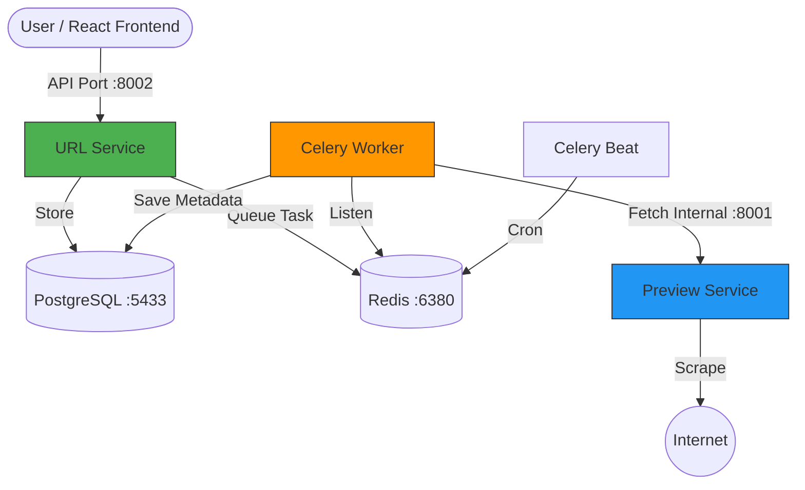

# Module 9: Microservices Essentials - Distributed URL Shortener

This project implements a master-worker microservices architecture. It decouples the core URL management from the external scraping logic, ensuring high performance and system resiliency.

## 🏗️ Full-Stack Architecture



## 📁 Repository Structure

```text
module9/
├── url/               # The "Orchestrator" (Users, Shortening, Analytics)
├── preview_service/   # The "Scout" (Stateless Metadata Scraper)
└── docker-compose.yml # The "Master Config" (Starts 6 containers)
```

## 🚀 How to Start with Docker

### 1. Launch the Cluster
```powershell
# Navigate to the root module9 folder
docker-compose up -d --build
```

### 2. Prepare the Environment
```powershell
# Run migrations inside the Web container
docker exec -it m9_web python manage.py migrate

# Create your primary admin
docker exec -it m9_web python manage.py createsuperuser
```

### 3. Master Access Table
| Resource | URL |
|----------|-----|
| **Main API Swagger** | [http://localhost:8002/api/schema/swagger-ui/](http://localhost:8002/api/schema/swagger-ui/) |
| **Preview API Swagger** | [http://localhost:8001/schema/swagger-ui/](http://localhost:8001/schema/swagger-ui/) |
| **Admin Panel** | [http://localhost:8002/admin/](http://localhost:8002/admin/) |
| **Redis Explorer** | Connect to `localhost:6380` |

---

## 📡 API Overview (JSON Examples)

### Create & Scrape Flow
1. **Request** (`POST :8002/api/v1/urls/`):
   ```json
   {"original_url": "https://github.com"}
   ```
2. **Internal Response** (Preview Service `:8001`):
   ```json
   {"title": "GitHub", "description": "Build software...", "favicon": "..."}
   ```

## 🌐 Frontend & CORS
The system is ready for a React/Vue frontend out of the box. 
- **CORS Headers**: Handled by `django-cors-headers` in the URL service.
- **Access Control**: Configure `CORS_ALLOWED_ORIGINS` in `url/settings.py` to add your frontend domain (e.g., `http://localhost:3000`).

---

## 🛡️ Resiliency & Background Logic

This system is built for **High Availability** and **Reliability**. Even if external websites or microservices fail, the core system stays alive.

### 🍽️ The "Restaurant" Analogy
- **The Waiter (Web Service)**: Takes your order and gives you a receipt (Short URL) immediately.
- **The Order Slip (Redis)**: Your order is queued in the kitchen (Redis DB 0).
- **The Chef (Celery Worker)**: Works in the background without making you wait at the counter.
- **The Supplier (Preview Service)**: The Chef calls the Preview Service to get fresh metadata "ingredients".
- **The Plate (Postgres)**: Finished metadata is saved to the database record.

### 🛡️ Circuit Breaker & Retries
1. **Exponential Retries**: If a site is briefly down, Celery retries up to 3 times, waiting longer each time (2s, 4s, 8s).
2. **The Circuit Breaker (Safety Switch)**: If a specific domain fails **5 times** in a row, the app "trips" the breaker. It stops attempting to scrape that domain for 10 minutes to save resources.

---

---

## 🎭 Step-by-Step Presentation Demo

Follow these 3 scenarios to perform a "Live" demonstration of your microservices architecture.

### 🧪 Scenario 1: The "Order Queue" (Worker Stop Test)
*Goal: Prove that Redis acts as a buffer and tasks are processed asynchronously.*

1.  **Stop the Worker**:
    ```powershell
    docker-compose stop celery_worker
    ```
2.  **Trigger Action**: Create a URL for `https://google.com` via Swagger.
3.  **Visualization (Redis Insight)**:
    - Open **Database 0**.
    - Find the key `celery` (it's a List).
    - **Explain**: *"The Web Service didn't wait. It created the link and put the Scraper task in this Redis queue. It's safe here even though the Worker is offline."*
4.  **Restart & Verify**:
    ```powershell
    docker-compose start celery_worker
    ```
    - The `celery` key in Redis will vanish instantly. Check the URL in your DB—the Title and Description are now filled!

### 🧪 Scenario 2: The "Safety Shield" (Circuit Breaker Test)
*Goal: Show how the app protects itself when the Preview Service (or a website) is down.*

1.  **Break the Connection**:
    ```powershell
    docker-compose stop preview
    ```
2.  **Watch the "Struggle" (Logs)**:
    - Run `docker-compose logs -f celery_worker`.
3.  **Trigger Failure**: Create a URL for `https://failme.xyz`.
    - **Outcome**: You will see **Retries** in the logs (`Retry 0/3`, `Retry 1/3`...). Explain that **Exponential Backoff** is happening (waiting longer each time).
4.  **Trip the Breaker**: Create that same URL 5 times total.
    - **Visualization (Redis Insight)**: In **Database 1**, a key named `blocked:failme.xyz` appears. 
    - **Outcome**: Create a 6th URL. The logs show `Skipping fetch... (blocked)`. 
    - **Explain**: *"The app realized the service is down and 'tripped the breaker' to save resources."*

### 🧪 Scenario 3: All-in-One Manual Testing
*Goal: Quick verification of every core endpoint.*

| Feature | Step | Visual Feedback |
| :--- | :--- | :--- |
| **Auth** | Login via Swagger (`/api/v1/auth/login/`) | Returns `access` and `refresh` tokens. |
| **Create**| `POST /api/v1/urls/` | Returns `201 Created` with `short_url`. |
| **Redirect**| Open `http://localhost:8002/api/v1/{short_code}/` | Browser redirects to the **original URL**. |
| **Metadata**| `GET /api/v1/urls/` | `title`, `description`, `favicon` are populated. |
| **Update**  | `PUT /api/v1/urls/{short_code}/` | Allows updating alias or metadata. |
| **Analytics**| `GET /api/v1/analytics/{short_code}/` | Shows `total_clicks` and `clicks_by_country`. |
| **Business** | Try custom alias as **Free** user | Returns `400 Bad Request` (Premium feature). |
| **Admin** | Open `http://localhost:8002/admin/` | View/Edit URLs and Clicks in a UI. |

---

## 📋 Quick JSON Payloads (Copy-Paste for Swagger)

Use these snippets to quickly demonstrate the API's functionality.

### 1. Authentication
**Register** (`POST /api/v1/auth/register/`):
```json
{
  "username": "tester",
  "password": "SecurePassword123!",
  "is_premium": true
}
```

**Login** (`POST /api/v1/auth/login/`):
```json
{
  "username": "tester",
  "password": "SecurePassword123!"
}
```

### 2. URL Management
**Create URL** (`POST /api/v1/urls/`):
```json
{
  "original_url": "https://www.google.com",
  "custom_alias": "search-boss"
}
```

**Update URL** (`PUT /api/v1/urls/{short_code}/`):
```json
{
  "title": "New Cool Title",
  "description": "Updated description for the presentation."
}
```

---

## 🛠️ Essential Monitoring Commands

- **Live Logs**: `docker-compose logs -f celery_worker` (Best for showing retries).
- **Service Status**: `docker-compose ps` (Check if anything is "Exit 1").
- **DB Check**:
  ```powershell
  docker exec -it m9_postgres psql -U postgres -d module7_db -c "SELECT short_url, title, click_count FROM shortener_url;"
  ```

## 📝 Observability Info
The project uses **Structured JSON Logging** for production readiness.
- **Log Location**: `url/logs/app.log`
- **Format**: `{"asctime": "...", "levelname": "INFO", "message": "...", "url_id": ...}`
