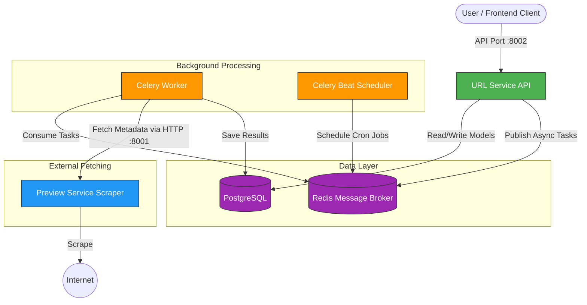

# Architecture & System Design

## High-Level Architecture

The Distributed URL Shortener is built using a Master-Worker Microservices Architecture. The system is decoupled into specialized services communicating via HTTP and message queues.

## Core Components

1. **URL API Service (The Master)**
   - Built with Django & Django REST Framework.
   - Handles all user-facing requests (Auth, CRUD operations for URLs, Analytics).
   - Responsible for writing initial data to PostgreSQL and dispatching background tasks to Redis.

2. **Preview Service (The Scout)**
   - A stateless microservice explicitly dedicated to fetching HTML content from external websites and parsing Open Graph metadata (Title, Description, Favicon).
   - Kept separate so that scraping-induced memory leaks, spikes, or crashes do not affect the main URL service.

3. **Background Workers (The Kitchen)**
   - Built using Celery.
   - Listens to Redis queues. Takes URLs, requests the metadata from the Preview Service, and updates the PostgreSQL records when complete.

4. **Message Broker (Redis)**
   - Acts as the task queue for Celery.
   - Buffers tasks to ensure the API never blocks while waiting for web scraping to complete.

5. **Primary Database (PostgreSQL)**
   - Stores Users, URLs, tags, and all click analytics.

## Key Resilience Patterns

- **Asynchronous Execution:** Users aren't forced to wait for slow HTTP requests to external websites when creating a link.
- **Circuit Breaker:** If an external domain repeatedly fails to respond to scrape attempts, the system prevents further attempts to that domain for a cooldown period.
- **Stateless Scaling:** The `Preview Service` and `Celery Workers` can be horizontally scaled under heavy load independently of the main API.
