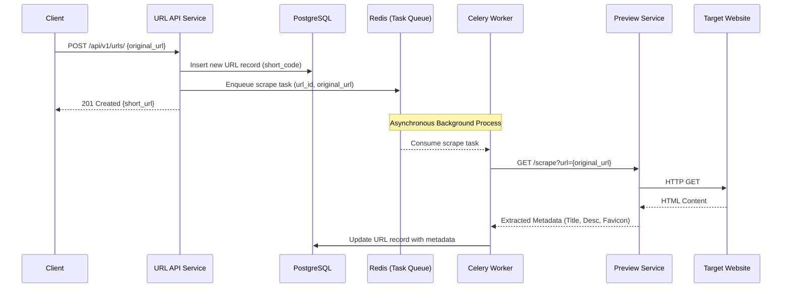
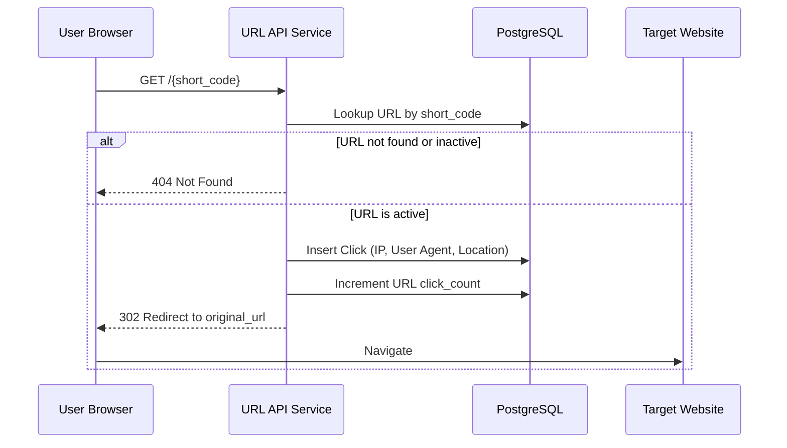

# Dataflow Diagrams

This document illustrates how data moves through the Distrbuted URL Shortener system during key operations.

## 1. URL Creation & Background Processing Flow

When a user submits a long URL to be shortened, the system immediately returns a short link while deferring the heavy lifting (web scraping) to background workers.

## 2. Redirection & Click Tracking Flow

When a user clicks on a shortened link, the system captures analytic data before sending them to the destination.

## Data Protection Mechanisms

### Circuit Breaker
If the `Preview Service` fails to scrape a target website 5 times consecutively, the Worker pushes a `blocked:{domain}` key to Redis. Subsequent tasks for that domain are skipped for 10 minutes to conserve resources and prevent cascading failures.
