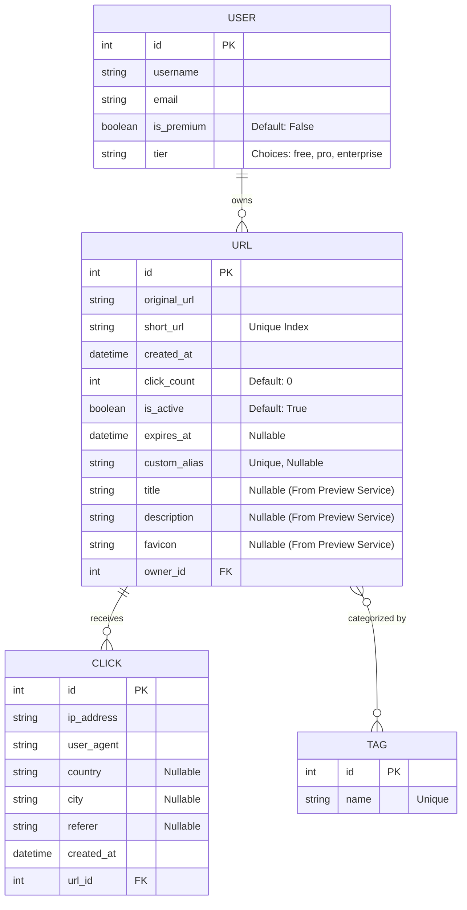

# Entity Relationship Diagram (ERD)

This document outlines the database schema for the Distributed URL Shortener service.

## Diagram

## Description of Entities

1. **USER**: Represents the application users who can create and manage their shortened URLs. Users have tiers (free, pro, enterprise) which can dictate feature access limits (like custom aliases).
2. **URL**: The core entity storing shortened link information. Includes raw URL, short code, and scraped metadata (title, description, favicon).
3. **CLICK**: Represents a single navigation event through a shortened link. Captures granular analytics like IP, location, and user agent.
4. **TAG**: Used to group and filter URLs. Has a Many-to-Many relationship with URLs.
