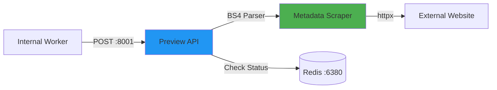

# URL Preview Microservice (Module 9)

A lightweight, stateless microservice dedicated to scraping and extracting metadata from external websites. It serves as a resilient "scout" for the main application.

## 🏗️ Architecture



**Flow:**
1. Incoming `POST /fetch-preview/` with a URL.
2. Checks Circuit Breaker in Redis to see if the domain is blocked.
3. Uses `httpx` to fetch the HTML content.
4. Uses `BeautifulSoup` to parse Title, Meta Description, and Favicon.
5. Returns a clean JSON response.

## 🚀 Run with Docker (Standalone)

This service can be built and run independently for testing.

### 1. Build the Scraper Image
```bash
# Navigate to preview_service folder
cd c:\Users\Amalitech\Desktop\amali\Labs\Labs\module9\preview_service

# Build the custom image
docker build -t my-preview-service .
```

### 2. Run the Container
```bash
# Run in the foreground to see logs
docker run --rm --name preview-run -p 8001:8001 my-preview-service
```

### 3. Important Docker Commands
```bash
# View live scraping logs
docker logs -f preview-run

# Force stop and remove
docker stop preview-run
```

## 📡 API Endpoints

### 1. Fetch Preview
- **Endpoint:** `POST /fetch-preview/`

**Request Body:**
```json
{
  "url": "https://www.wikipedia.org"
}
```

**Response Body:**
```json
{
  "title": "Wikipedia",
  "description": "Wikipedia is a free online encyclopedia...",
  "favicon": "https://www.wikipedia.org/static/apple-touch/wikipedia.png"
}
```

## 🌐 Frontend & Swagger
While primarily an internal service, you can interact with it via:
- **Swagger UI**: [http://localhost:8001/schema/swagger-ui/](http://localhost:8001/schema/swagger-ui/)
- **CORS**: This service includes permissive CORS headers for local debugging if needed.

## ⚠️ Resiliency (Circuit Breaker)
If a website (e.g., `malicious-site.com`) fails more than **5 times**, the service will "Open the Circuit" using Redis. 
- It will stop trying to scrape that site for 10 minutes.
- This protects your server from wasting resources on dead or blocking websites.
