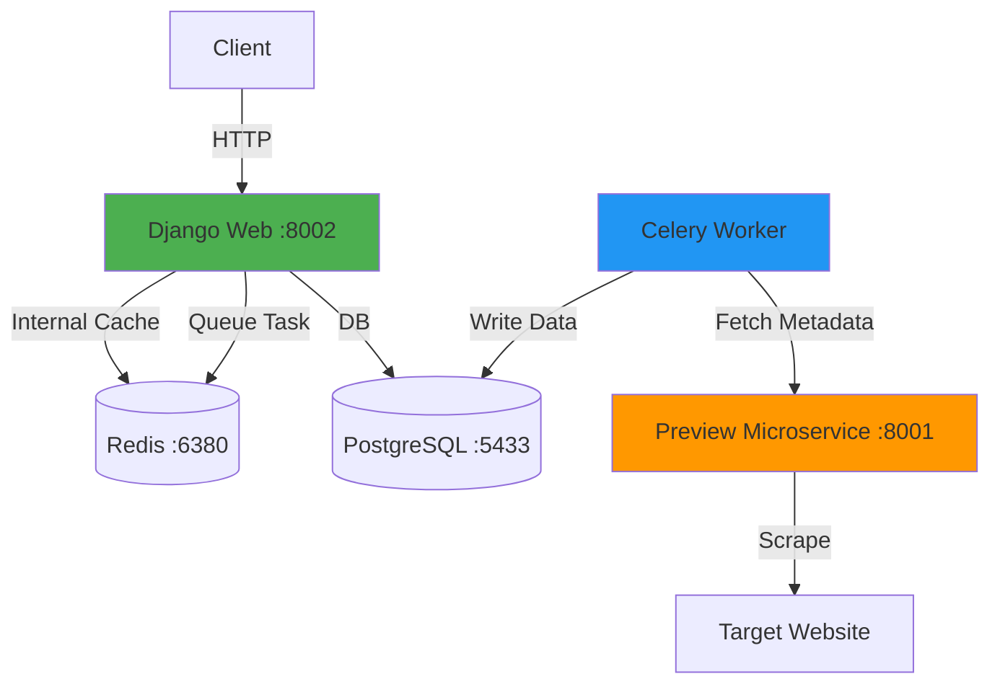

# Main URL Shortener Service (Module 9)

A production-ready URL microservice featuring **JWT authentication**, **Redis caching**, **async task processing**, and **inter-service communication** with an external URL Preview service.

## 🚀 Features

- **Microservices Integration**: Communicates with a separate `preview_service` to fetch page metadata (title, description, favicon).
- **Resiliency Patterns**: Implements exponential backoff retries and graceful failure handling for inter-service calls.
- **API Versioning**: Standardized `/api/v1/` routing for all endpoints.
- **CORS Enabled**: Configured for seamless frontend (React/Vue) integration.
- **JWT Authentication** with role-based access control.
- **Redis Caching** for instant redirects.
- **Async Metadata Fetching** via Celery.

## 🏗️ Architecture



**Data Flow:**
1. URL Creation → Web → `fetch_url_metadata_task` queued.
2. Celery Worker → POST `preview:8001/fetch-preview/`.
3. Preview Service → Scrapes Target Website → Returns Metadata.
4. Celery Worker → Updates Postgres with Title, Description, Favicon.

##  Tech Stack

- Django 5.0.1 + DRF 3.14
- PostgreSQL 15 + Redis 7
- Celery 5.3.0 + django-celery-beat
- httpx (for async service-to-service calls)
- BeautifulSoup4 (for metadata extraction in preview service)

##  How to Run with Docker

### 1. Build and Start All
Run this from the `module9` folder:
```bash
docker-compose up -d --build
```

### 2. Standard Docker Operations
```bash
# Run Database Migrations
docker exec -it m9_web python manage.py migrate

# Create Admin User
docker exec -it m9_web python manage.py createsuperuser

# View Live Logs (Main App)
docker-compose logs -f web

# Stop everything
docker-compose down
```

## 📡 API Endpoints

### 1. Authentication
**Register User**
- `POST /api/v1/auth/register/`
```json
{
  "username": "tester",
  "password": "SecurePassword123!",
  "is_premium": true
}
```

**Login**
- `POST /api/v1/auth/login/`
```json
{
  "username": "tester",
  "password": "SecurePassword123!"
}
// Response: {"access": "...", "refresh": "..."}
```

---

### 2. URL Management
**Create URL (Triggers Scraper)**
- `POST /api/v1/urls/`
- Authorization: `Bearer <access_token>`
```json
{
  "original_url": "https://www.wikipedia.org",
  "custom_alias": "wiki-link"
}
```

**List URLs (Metadata Included)**
- `GET /api/v1/urls/`
- Response Example:
```json
{
  "count": 1,
  "results": [{
    "short_url": "wiki-link",
    "title": "Wikipedia",
    "description": "Wikipedia is a free online encyclopedia...",
    "favicon": "https://wikipedia.org/favicon.ico"
  }]
}
```

---

### 3. Analytics
**Get Detailed Stats**
- `GET /api/v1/analytics/{short_code}/`
- Response Example:
```json
{
  "url": "wiki-link",
  "total_clicks": 42,
  "clicks_by_country": [{"Rwanda": 30}, {"France": 12}]
}
```

## 🌐 Frontend (CORS) Integration
To connect a React or Vue frontend, the service is configured with `django-cors-headers`.

### Important Headers
- `Access-Control-Allow-Origin`: Configured in `settings.py` (CORS_ALLOWED_ORIGINS).
- `Authorization`: Must be sent as `Bearer <token>` for all protected endpoints.

Example Fetch (React):
```javascript
fetch('http://localhost:8002/api/v1/urls/', {
  method: 'POST',
  headers: {
    'Content-Type': 'application/json',
    'Authorization': `Bearer ${token}`
  },
  body: JSON.stringify({ original_url: '...' })
})
```

## 🧪 Testing
```powershell
docker exec -it m9_web python manage.py test shortener
```
