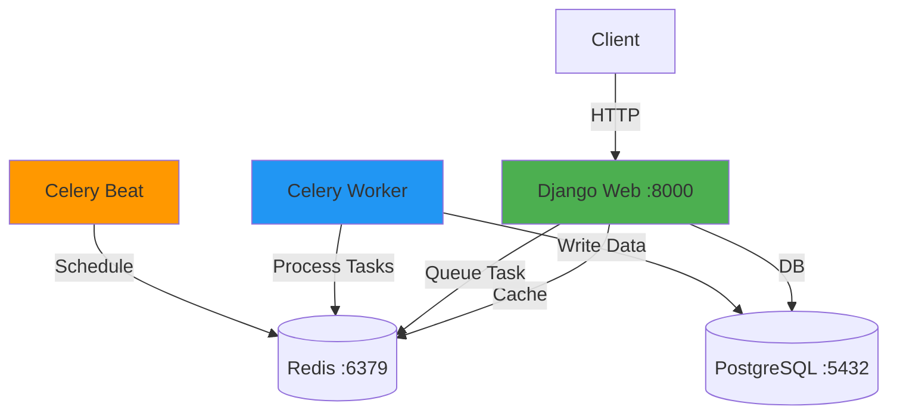

# Module 9: URL Microservice

A production-ready URL microservice with **JWT authentication**, **Redis caching**, **async task processing**, and **structured logging**. This service handles the core URL shortening, redirection, and analytics in the Module 9 Microservices architecture.

## 🚀 Features

- **JWT Authentication** with role-based access control (Free/Premium tiers)
- **Redis Caching** for instant redirects
- **Async Click Tracking** via Celery (write-behind pattern)
- **Periodic Cleanup Tasks** with Celery Beat
- **Structured JSON Logging** for production monitoring
- **Health Monitoring** endpoint
- **Tag Management** for organizing URLs

## 🏗️ Architecture



**Data Flow:**
1. URL Creation → Web → Postgres → Redis (cache)
2. Redirect → Web → Redis (cache hit) → Instant redirect
3. Click Tracking → Async Task → Worker → Postgres (non-blocking)
4. Cleanup → Beat (nightly) → Worker → Postgres

## Tech Stack

- Django 5.0.1 + DRF 3.14
- PostgreSQL 15 + Redis 7
- Celery 5.3.0 + django-celery-beat
- Docker + Docker Compose
- python-json-logger

## How to Run (Standalone)

### 1. Start Services

```bash
# Navigate to project
cd c:\Users\Amalitech\Desktop\amali\Labs\Labs\module9\url

# Build and start all containers
docker-compose up -d --build

# Verify 5 containers running
docker-compose ps
```

### 2. Run Migrations

```bash
docker exec -it url_shortener_web python manage.py migrate
docker exec -it url_shortener_web python manage.py createsuperuser
```

### 3. Access Application

- **Swagger UI**: http://localhost:8000/api/schema/swagger-ui/
- **Health Check**: http://localhost:8000/health-check/
- **Admin**: http://localhost:8000/admin/

## API Endpoints

### Authentication
| Method | Endpoint | Auth | Description |
|--------|----------|------|-------------|
| POST | `/accounts/register/` | -| Register user |
| POST | `/accounts/login/` | - | Get JWT tokens |
| POST | `/accounts/token/refresh/` | -| Refresh token |

### URL Management
| Method | Endpoint | Auth | Description |
|--------|----------|------|-------------|
| POST | `/api/urls/` | ✅ | Create short URL |
| GET | `/api/urls/` | ✅ | List URLs (paginated) |
| GET | `/{short_code}/` | - | Redirect to original |
| PUT | `/api/urls/{short_code}/` | ✅ | Update URL |
| GET | `/api/tags/` | ✅ | List available tags |

### Monitoring
| Method | Endpoint | Auth | Description |
|--------|----------|------|-------------|
| GET | `/health-check/` | - | DB & Redis status |
| GET | `/api/schema/swagger-ui/` | - | API docs |

## Quick API Usage

**Register:**
```bash
POST /accounts/register/
{
  "username": "testuser",
  "email": "user@example.com",
  "password": "SecurePass123!",
  "password_confirm": "SecurePass123!",
  "is_premium": false
}
```

**Login:**
```bash
POST /accounts/login/
{
  "username": "testuser",
  "password": "SecurePass123!"
}
# Returns: {"access": "...", "refresh": "..."}
```

**Create URL with Tags:**
```bash
POST /api/urls/
Authorization: Bearer <access_token>
{
  "original_url": "https://example.com",
  "tags": ["Marketing", "Personal"]
}
```

## Testing

### Using Swagger UI
1. Open http://localhost:8000/api/schema/swagger-ui/
2. Register → Login → Copy access token
3. Click "Authorize" → Enter `Bearer <token>`
4. Create URLs and test redirects

### Test Async Tasks
```bash
# Access a URL to trigger click tracking
curl -L http://localhost:8000/<short_code>/

# Check worker logs
docker-compose logs celery_worker | grep "Click tracked"
```

## Project Structure

```
module8/url/
├── accounts/          # Authentication
├── api/              # URL endpoints (with logging)
├── shortener/        # Models & Celery tasks
├── core/             # Health check
├── url/              # Settings & Celery config
├── logs/             # JSON logs (app.log, errors.log)
├── docker-compose.yml # 5 services
└── requirements.txt
```

## Security

- JWT token authentication
- PBKDF2 password hashing
- Rate limiting (5 login attempts/min)
- Owner-based permissions
- Input validation

## Logging

All logs in JSON format:
```json
{
  "asctime": "2026-02-16 14:00:00",
  "name": "api.views",
  "levelname": "INFO",
  "message": "URL created successfully",
  "url_id": 1,
  "user": "testuser"
}
```

View logs: `cat logs/app.log` or `docker-compose logs web`

## Performance & Optimization

- **Redis caching**: 100x faster redirects
- **Async tasks**: Non-blocking click tracking
- **Pagination**: Efficient list retrieval for thousands of links
- **Service Layer**: Clean separation of business logic from views

---

**Author**: Ishimwe Diane | **Module**: 9 - Microservices 🚀
